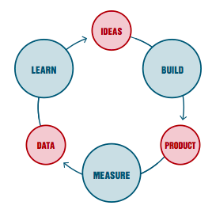

```{r, include=FALSE}
knitr::opts_chunk$set(echo=TRUE, message=FALSE, warning=FALSE, eval=FALSE, 
                      cache=TRUE, fig.width=16/2, fig.height=9/2)
# Set seed value of random number generator to get "replicable" random numbers.
# Why 76? Because of https://www.youtube.com/watch?v=xjJ7FheCkCU
set.seed(76)
```

<style>
h1{font-weight: 400;}
</style>


<!--
{target="_blank"}
-->


***


# Mini-project 1 {#MP1}

## Administrative notes

* **Executive summary**: You will be making a submission to the [House Prices: Advanced Regression Techniques](https://www.kaggle.com/c/house-prices-advanced-regression-techniques){target="_blank"} Kaggle competition based on a fitted spline model. The competition's score for leaderboard purposes is the "root mean squared logarithmic error" (RMSLE).
* Due Wednesday 2/13 5pm on Moodle.
* You will be given time to work on MP1 in class on Wednesday 2/13.
* Groups: Posted on [Moodle](https://moodle.smith.edu/course/view.php?id=33108){target="_blank"}. Whoever member \#1 is will be the group leader.  
Ex: Group \#1's leader is LQ.


## Working on your project {#MP1-working}

* Download the `MP1.zip` archive file containing the MP1 RStudio Project by clicking <a href="static/MP1.zip" download>here</a>. 
* **Windows users**: Be sure to "extract" the contents of `MP1.zip` to a folder on your machine.
* Whenever working on MP1, be sure to be in "RStudio Project mode" by looking for the RStudio Project icon:  
{ width=100px }
* Get in "RStudio Project mode" either by:
    1. Clicking the `MP1.Rproj` file
    1. Selecting `MP1` from the drop-down menu of RStudio Projects in the top right of RStudio
* Knit the `MP1.Rmd` file and read over everything once.
* Whenever you're not working on your project, click the RStudio Project icon in the top right of RStudio and select "Close Project".
* **Added on Mon 2/11**: It is your responsibility to stay on top of all messages sent in the `#mp1` channel in Slack.
* **Added on Mon 2/11**: Feel free to use external sources, but please cite them using R Markdown footnotes. For example adding `^[This is my [source](https://www.smith.edu/)]` at the end of a sentence in R Markdown will yield: ^[This is my [source](https://www.smith.edu/)]


## What to submit

* **Group leader only**: Submit a `MP1_Group_XX.zip` archive file of **all** the contents of your `MP1` RStudio Project folder.  
Ex: Group \#1's leader LQ will submit a single file `MP1_Group_01.zip` on Moodle.
* **Both group members**: Complete the following peer evaluation [Google Form](https://docs.google.com/forms/d/e/1FAIpQLSc0F4X5s01LEfQ_-1ZJRnzL_jH6K9hnyjJVwLnfKq7tcqGo-A/viewform){target="_blank"}.  
Ex: Both Group \#1's members LQ and EN must complete the Google Form to receive full credit.


## Grading

1. **Minimally viable product:** Grade: 8/10. Fit a splines model with an arbitrarily chosen numerical predictor variable $x$ and an arbitrarily chosen degrees of freedom $df$. Using this model make a submission to Kaggle that returns a valid $\text{RMLSE}$ score. Also:
    + Your `MP1.Rmd` R Markdown "knits" correctly. In other words, an `.html` report gets created with no errors.
    + Complete the exploratory data analysis where all visualizations are as "stand-alone" as possible by having informative labels and titles.
    + Remove all superfluous non-informative output from your report that only makes it more painful/tiresome to read.
    + Both group members submit their peer evaluations. No extensions will be granted.
1. **Due diligence:** Grade: 8.5/10. Explore choices degrees of freedom $df$ in some non-arbitrary fashion. This could mean many things, including:
    + Explicitly compare the $\text{RMLSE}$ for two values of $df$.
    + Implement the validation set prediction framework you saw in [Chapter 4](https://campus.datacamp.com/courses/modeling-with-data-in-the-tidyverse/model-assessment-and-selection?ex=10){target="_blank"} of the Modeling with Data in the tidyverse DataCamp course.
1. **Reaching for the stars:** Grade: 9/10. Fully implement a crossvalidation scheme from scratch in order to:
    + Find the optimal "model complexity". In other words, find the optimal degrees of freedom $df^*$ in a systematic fashion.
    + Get a good estimate $\widehat{\text{RMLSE}}$ of the $\text{RMLSE}$ that Kaggle will return for your submission.
1. **Point of diminishing returns:** Grade: 9.5/10. Create a visualization like in [Lec01 slides \#36](http://rudeboybert.rbind.io/talk/2019-01-13-Williams.pdf#page=36){target="_blank"} that shows
    + The relationship between "model complexity" set by $df$ and $\text{RMLSE}$ for both the training and test data.
    + That the optimal $df^*$ is the "just right" balance point between underfitting and overfitting.
1. **Polishing the cannonball:** Grade: 10/10. Try to get the highest Kaggle score in the class!


## Suggestions

**Always start simple!** Don't try to do things perfectly from the very beginning, but instead follow the [Build, Measure, Learn](http://theleanstartup.com/principles){target="_blank"} cycle espoused by certain individuals in the startup world:

1. **Build**: Start by building a [minimially viable product](https://www.forbes.com/sites/quora/2018/02/27/what-is-a-minimum-viable-product-and-why-do-companies-need-them/#178bd8a2382c){target="_blank"}. 
1. **Measure**: Collect feedback and perform assessments on your product.
1. **Learn**: Learn from this data to figure out what improvements can be made, what complexity can be added, what should be removed in the next version of your product.

Repeat the above and slowly **iterate** to perfection while keeping in mind that **done is better than perfect.** 

<center>
{ width=275px } { width=525px }
</center>

## Solutions {#MP1-solutions}

* [`MP1_albert_MVP.html`](static/MP1_albert_MVP.html){target="_blank"}
* <a href="static/MP1_albert_MVP.Rmd" download>`MP1_albert_MVP.Rmd`</a>


***


# Mini-project 2 {#MP2}

## Administrative notes

* **Executive summary**: You will be making a submission to the [House Prices: Advanced Regression Techniques](https://www.kaggle.com/c/house-prices-advanced-regression-techniques){target="_blank"} Kaggle competition based on a fitted ~~spline~~ multiple regression model. The competition's score for leaderboard purposes is the "root mean squared logarithmic error" (RMSLE).
* **Due Wednesday 3/6 5pm on Moodle**. 
* You will be given time to work on MP2 in class on Monday 3/4 and Wednesday 3/6.
* Groups: You must work with a different partner than MP1
    + **If you already have a group**: Designate a team leader and have them fill out this [Google Sheet](https://docs.google.com/spreadsheets/d/1YRlmq4pvrzmtq0iUha4uCwg2Xwiz3l1_e5ji-rWoqlc/){target="_blank"}.
    + **If you need a group**: Please fill out this [Google Form](https://docs.google.com/forms/d/e/1FAIpQLSeifexbjkXQNgm6d7bvSn0KcYoB6RVH5ab50o-RS6NfAS58AQ/viewform) and I'll assign one for you.


## Working on your project {#MP2-working}

* Join the `#mp2` Slack channel.
* Download the `MP2.zip` archive file containing the MP2 RStudio Project by clicking <a href="static/MP2.zip" download>here</a>.
* **Windows users**: Be sure to "extract" the contents of `MP2.zip` to a folder on your machine.
* Whenever working on MP2, be sure to be in "RStudio Project mode" either by:
    1. Clicking the `MP2.Rproj` file
    1. Selecting `MP2` from the drop-down menu of RStudio Projects in the top right of RStudio.
* Knit the `MP2.Rmd` file and read over everything once.
* Whenever you're not working on your project, click the RStudio Project icon in the top right of RStudio and select "Close Project".
* Policies:
    + You may use a function from a package to compute the RMLSE.
    + You may not use a function from a packge to perform cross-validation; please code it up manually.
    + Feel free to use external sources, but please cite them using R Markdown footnotes. For example adding `^[This is my [source](https://www.smith.edu/)]` at the end of a sentence in R Markdown will yield: ^[This is my [source](https://www.smith.edu/)]
* **Clarifications added Friday 3/1 5PM**:
    + From the "Minimally viable product" phase, you can remove the `## Comparisons of estimated scores and Kaggle scores` subsection, as this is part of the following "Due diligence" phase
    + From the "Due diligence" phase, you can remove the `## Model fitting`, `## Estimate of your Kaggle score`, `## Create your submission CSV`, and `## Screenshot of your Kaggle score` subsections, as those were part of the previous "Minimally viable product" phase.
* **Clarifications added Tuesday 3/5 8AM**:
    + For the "point of diminishing returns" phase asking you to use a "subset selection" method from Chapter 6.1, don't start with all 81 predictor variables, but rather start with only the 6 variables from the "reaching for the stars" phase. Think of it this way: you are "shopping" for variables to include in your model and want to pick the "best" ones to put in your shopping cart (your ultimate model). Your choice of variables to "shop from" are not ALL 81 predictors, since it would take forever to do an exploratory data analysis, clean, and make sure all variables work in a fitted model. Rather your choice of variables to "shop from" are the 6 predictors from the "reaching for the stars" phase, since you already did an exploratory data analysis on, cleaned, and made sure all variables work in a fitted model. So after applying a subset selection method, you'll end up with a model with either 0, 1, ..., 5, or 6 of your "reaching for the stars" variables.  
    **Why are we doing this?**  Later on, we'll study an even MORE principled way to "shop" for variables than "subset selection" called LASSO regularization. For a preview see Chapter 6.2.2. in the ISLR textbook.
    + For all three models $\widehat{f}_{1}$, $\widehat{f}_{2}$, $\widehat{f}_{3}$, your estimate of $\widehat{\text{RMLSE}}$ **must** closely match the $\text{RMLSE}$ that Kaggle returns; the grader will be instructed to grade accordingly. By "closely match" it is generally meant that they must be of the same [order of magnitude](https://en.wikipedia.org/wiki/Order_of_magnitude){target="_blank"}.  
    **Why are we doing this?** Because in an active Kaggle competition, you are almost always limited in the number of submissions you can make in a day. For example, in the currently running [Google Analytics Customer Revenue Prediction](https://www.kaggle.com/c/ga-customer-revenue-prediction/rules){target="_blank"} competition, you can only make 5 submissions a day, hence only get 5 scores a day. If you're serious about winning a competition however, you'll definitely need to evaluate more than 5 models a day. So if you are limited in the number of "real" $\text{RMLSE}$ scores you can obtain in a day, what is the next best thing? Getting *estimates* of the score $\widehat{\text{RMLSE}}$.
    + You are not required to explicitly submit any exploratory visualizations for this MP. However you should still be making visualizations during your model fitting phase, just not invest the time to polish them. That being said, including a well polished visualization that argues why a particular predictor variable should be used can be a very effective way to provide insight and hence make your report stand out. 
    + What is meant by "remove all superfluous non-informative output"? Think of it this way: If two people present two R Markdown reports containing roughly the same amount of new insight and information, but one is 2 pages long and one is 20 pages long, which one do you think people will read? The answer is obvious. However, what precisely constitutes "non-informative output" is often a subjective and non-obvious choice. Whatever your choice may be however, you'll need to **own that choice**. That being said, one example of obviously "non-informative output" is including the entire contents of a 10k row data frame in your report; no human on earth can digest 10k rows of data.
* **Hints added Tuesday 3/5 8AM**:
    + Crossvalidation does one thing and one thing only: it returns an estimate $\widehat{\text{RMLSE}}$ of the true $\text{RMLSE}$ when you don't have access to the $y$'s in the test set. But unlike the "validation set" approach, every observation gets predicted once, in other words every $y$ gets a turn at being predicted with a $\widehat{y}$. Now, what you do with these estimates $\widehat{\text{RMLSE}}$ is another question. So for example in MP1, we used these estimates $\widehat{\text{RMLSE}}$ to choose the optimal complexity of the splines model as determined by the optimal $df^*$; but choosing the optimal complexity of a model is not *inherently* part of crossvalidation; it merely *uses* the results of crossvalidation.
    + *"Help! I'm having a lot of trouble working with categorical variables!"* Good! That is the point of this MP! When you're encountering such issues, start peeling away all the layers of abstraction and **look at your data**. Go inside the inputs and outputs of functions and `for` loops and look at the raw values, compute summary statistics, and create visualizations. You'll almost always find the source of your error/issue somewhere in the data.
    + **Start simple and build up, don't start complex and build down!** Compare these two approaches:
        1. You fit a model using predictors $x_1, x_2$ and it returns working predictions $\widehat{y}$. You fit the next iteration of the model using $x_1, x_2, x_3$ but get an error. What is the source of the problem?
        1. You fit a model using **all** predictors $x_{1}, x_{2}, x_{3}, x_{4}, x_{5}, x_{6}, x_{7}, x_{8}, x_{9}, x_{10}, x_{11}, x_{12}, x_{13}, x_{14}, x_{15}, x_{16}, x_{17}, x_{18}, x_{19}, x_{20}, x_{21}, x_{22}, x_{23}, x_{24}, x_{25}, x_{26},$  
        $x_{27}, x_{28}, x_{29}, x_{30}, x_{31}, x_{32}, x_{33}, x_{34}, x_{35}, x_{36}, x_{37}, x_{38}, x_{39}, x_{40}, x_{41}, x_{42}, x_{43}, x_{44}, x_{45}, x_{46}, x_{47}, x_{48}, x_{49}, x_{50},$  
        $x_{51}, x_{52}, x_{53}, x_{54}, x_{55}, x_{56}, x_{57}, x_{58}, x_{59}, x_{60}, x_{61}, x_{62}, x_{63}, x_{64}, x_{65}, x_{66}, x_{67}, x_{68}, x_{69}, x_{70}, x_{71}, x_{72}, x_{73}, x_{74},$   
        $x_{75}, x_{76}, x_{77}, x_{78}, x_{79}, x_{80}, x_{81}$  
        but get an error. What is the source of the problem?

<!--
library(tidyverse); str_c("x_{", 1:81, "}", sep = "") %>% str_c(collapse = ", ")
-->

## What to submit

* **Group leader only**: Submit a `MP2_Group_XX.zip` archive file of **all** the contents of your `MP2` RStudio Project folder.  
* **Both group members**: Complete the following peer evaluation [Google Form](https://docs.google.com/forms/d/e/1FAIpQLSf0a9F3_tZNtil3_IZBwPpvxuC2ubmWs54fDuFmmxYtcrhN-w/viewform){target="_blank"}. Both group members must complete the Google Form to receive full credit.


## Grading

1. **Baseline:** Projects that do not satisfy all "baseline" criteria should expect to get a grade of less than 8/10.
    + Your `MP2.Rmd` R Markdown file must absolutely "knit" correctly. 
    + Regardless of which model you fit, you must output a submission `.csv` file that returns a valid $\text{RMLSE}$ score on Kaggle. The grader will test this.
    + All plots (if any) must be "stand-alone" as possible by having informative labels and titles. 
    + Remove all superfluous non-informative output from your report that only makes it more painful/tiresome to read.
    + Both group members submit their peer evaluations. No extensions will be granted.
1. **Minimally viable product:** Grade: 8/10.
    + Satisfy all "baseline" criteria.
    + Fit a regression model $\widehat{f}_{1}$ using one arbitrarily chosen numerical predictor and one arbitrarily chosen categorical predictor.
1. **Due diligence:** Grade: 8.5/10.
    + Satisfy all "baseline" and "minimally viable product" criteria.
    + Using the model $\widehat{f}_{1}$, obtain an estimate $\widehat{\text{RMLSE}}$ that closely matches the $\text{RMLSE}$ that Kaggle returns.
1. **Reaching for the stars:** Grade: 9/10. 
    + Satisfy all "baseline", "minimally viable product", and "due diligence" criteria.
    + Fit a regression model $\widehat{f}_{2}$ using **three** arbitrarily chosen numerical predictors and **three** arbitrarily chosen categorical predictors.
    + Using this model $\widehat{f}_{2}$, obtain an estimate $\widehat{\text{RMLSE}}$ that closely matches the $\text{RMLSE}$ that Kaggle returns.
    + Compare the $\widehat{\text{RMLSE}}$ and $\text{RMLSE}$ you obtain for $\widehat{f}_{2}$ with the ones you obtained with $\widehat{f}_{1}$. 
1. **Point of diminishing returns:** Grade: 9.5/10.
    + Satisfy all "baseline", "minimally viable product", "due diligence", and "reaching for the stars" criteria.
    + Fit a regression model $\widehat{f}_{3}$ choosing your predictor variables **from the 6 your chose in the "reaching for the stars" phase** in a non-arbitrary fashion using a method in Chapter 6.1 of the ISLR textbook.
    + Using this model $\widehat{f}_{3}$, obtain an estimate $\widehat{\text{RMLSE}}$ that closely matches the $\text{RMLSE}$ that Kaggle returns.  
    + Compare the $\widehat{\text{RMLSE}}$ and $\text{RMLSE}$ you obtain for all three models $\widehat{f}_{1}$, $\widehat{f}_{2}$, and $\widehat{f}_{3}$
1. **Polishing the cannonball:** Grade: 10/10.
    + Satisfy all "baseline", "minimally viable product", "due diligence", "reaching for the stars", and "point of diminishing returns" criteria.
    + Try to get the highest Kaggle score in the class!


## Suggestions

* Start simple and slowly add complexity. If you start with the most complex model possible and something doesn't work, you'll have a harder time debugging.
* In other words, add variables incrementally and build up your models. Don't start with everything and build down to a working model.


***


# Mini-project 3 {#MP3}

## Administrative notes

* **Executive summary**: You will be making a submission to the [DonorsChoose.org Application Screening: Predict whether teachers' project proposals are accepted](https://www.kaggle.com/c/donorschoose-application-screening/){target="_blank"} Kaggle competition based on a fitted logistic regression model. The competition's score for leaderboard purposes is the "Area under the Receiver Operating Characteristic Curve" (AUC).
* **Due Wednesday 3/27 10pm on Moodle**. 
* You will be given time to work on MP3 in class on Monday 3/25 and Wednesday 3/27.
* Groups: Posted on [Moodle](https://moodle.smith.edu/course/view.php?id=33108){target="_blank"}. Whoever member \#1 is will be the group leader.  
Ex: Group \#1's leader is BT.


## Working on your project {#MP3-working}

I will post all clarifications and hints in this section.

* Join the `#mp3` Slack channel.
* Download the `MP3.zip` archive file containing the MP3 RStudio Project by clicking <a href="static/MP3.zip" download>here</a>.
* **Windows users**: Be sure to "extract" the contents of `MP3.zip` to a folder on your machine.
* Whenever working on MP3, be sure to be in "RStudio Project mode" either by:
    1. Clicking the `MP3.Rproj` file
    1. Selecting `MP3` from the drop-down menu of RStudio Projects in the top right of RStudio.
* Knit the `MP3.Rmd` file and read over everything once.
* Whenever you're not working on your project, click the RStudio Project icon in the top right of RStudio and select "Close Project".
* Policies:
    + You may use a function from a package to compute the relevant Kaggle leaderboard score.
    + You may not use a function from a packge to perform cross-validation; please code it up manually.
    + Feel free to use external sources, but please cite them using R Markdown footnotes. For example adding `^[This is my [source](https://www.smith.edu/)]` at the end of a sentence in R Markdown will yield: ^[This is my [source](https://www.smith.edu/)]
* **Added on Wed 3/20 1pm**
    + On Moodle you'll be submitting the contents of your `MP3` RStudio Project folder **but not the data files! They are huge!**
    + Predictor variables:
        1. For the "Reaching for the stars" step, you'll be using the numerical predictor `teacher_number_of_previously_posted_projects`.
        1. For the "Point of diminishing returns" step, you'll be using the categorical predictor `project_grade_category`
    + When creating all ROC plots using `yardstick::roc_curve()` and computing all "Areas under the ROC (AUC)" using `yardstick::roc_auc()`, the `truth` input needs to be a `factor()` categorical variable with the `levels` ordered so that the first level corresponds to $y=1$. Click [here](https://rudeboybert.github.io/SDS192/tips_and_tricks.html#how_do_i_reorder_bars_in_a_barplot){target="_blank"} to see how to reoreder levels of a cateogorical variable. 
    + No crossvalidation necessary for this MP.
* **Added on Tue 3/26 6:30pm** The code below is a "minimally reproducible example" (AKA a [reprex](https://www.tidyverse.org/help/){target="_blank"}) of an AUC computation.
* **Added on Wed 3/27 1:45pm** No visualization needed for **Polishing the cannonball** phase. 

```{r, eval=FALSE}
library(tidyverse)
library(yardstick)
library(broom)

# Load example:
example <- read_csv("https://rudeboybert.github.io/SDS293/static/binary_example.csv")

# Input to glm() should be with y as a numerical variable. Do not convert
# y into a factor yet.
model <- glm(y ~ x_num, family = "binomial", data = example)

# Compute fitted probabilities p-hat:
fitted_points <- model %>%
  augment() %>%
  mutate(p_hat = 1/(1 + exp(-.fitted))) %>%
  select(y, x_num, p_hat)

# Plot with y as numerical so that we can compare it with p-hats. Do not convert
# y into a factor yet.
ggplot(fitted_points, aes(x = x_num)) +
  geom_jitter(aes(y = y), height = 0.01, width = 0.05) +
  geom_line(aes(y = p_hat), col = "red")

# Get AUC via roc_auc()
# -first argument (that is piped) is the data frame
# -second is truth, which is the outcome variable
# -third argument are the fitted probabilities corresponding to the binary
# outcome of interest. Here that y = 1
fitted_points %>%
  roc_auc(truth = y, p_hat)

# That doesn't work since y is numerical. So now:
# -Convert y into a factor/categorical variable
# -Set the first level of categorical variable to be "1" using fct_relevel()
# from the forcats package (Note there are many ways to do this)
fitted_points %>%
  mutate(y_as_factor = factor(y)) %>%
  mutate(y_as_factor = fct_relevel(y_as_factor, "1")) %>%
  roc_auc(truth = y_as_factor, p_hat)
```


## What to submit

* **Group leader only**: Submit a `MP3_Group_XX.zip` archive file with the contents of your `MP3` RStudio Project folder **but not the data files! They are huge!** You can assume I have them.
* **Both group members**: Complete the following peer evaluation [Google Form](https://docs.google.com/forms/d/e/1FAIpQLSfIRbLHxWMzvKHiB0nd5iXQatrsNGek3lkkHl5JXD921F5tDg/viewform){target="_blank"}. Both group members must complete the Google Form to receive full credit.


## Grading

1. **Baseline:** Projects that do not satisfy all "baseline" criteria should expect to get a grade of less than 8/10.
    + Your `MP3.Rmd` R Markdown file must absolutely "knit" correctly. 
    + Regardless of which model you fit, you must output a submission `.csv` file that returns a valid score on Kaggle. The grader will test this.
    + All plots (if any) must be "stand-alone" as possible by having informative labels and titles. 
    + Remove all superfluous non-informative output from your report that only makes it more painful/tiresome to read.
    + Both group members submit their peer evaluations. No extensions will be granted.
1. **Minimally viable product:** Grade: 8/10.
    + Satisfy all "baseline" criteria.
    + Fit a logistic regression model $\widehat{f}_{1}$ using **no predictor variables**, answer the stated question, get an estimate of your Kaggle score, make your predictions & submit them.
1. **Due diligence:** Grade: 8.5/10.
    + Satisfy all "baseline" and "minimally viable product" criteria.
    + Plot the corresponding ROC curve such that the area under the curve is $\geq 0.50$
1. **Reaching for the stars:** Grade: 9/10. 
    + Satisfy all "baseline", "minimally viable product", and "due diligence" criteria.
    + Fit a logistic regression model $\widehat{f}_{2}$ using the numerical predictor `teacher_number_of_previously_posted_projects`, create the single visualization with the 3 elements in it, get an estimate of your Kaggle score, make your predictions & submit them, plot the corresponding ROC curve such that the area under the curve is $\geq 0.50$.
1. **Point of diminishing returns:** Grade: 9.5/10.
    + Satisfy all "baseline", "minimally viable product", "due diligence", and "reaching for the stars" criteria.
    + Fit a logistic regression model $\widehat{f}_{3}$ using the cateogorical predictor `project_grade_category`, create the single visualization with the ~~3~~ 2 elements in it, get an estimate of your Kaggle score, make your predictions & submit them, plot the corresponding ROC curve such that the area under the curve is $\geq 0.50$.
1. **Polishing the cannonball:** Grade: 10/10.
    + Satisfy all "baseline", "minimally viable product", "due diligence", "reaching for the stars", and "point of diminishing returns" criteria.
    + Create an extended model $\widehat{f}_{4}$ by including other variables and try to get the highest Kaggle score in the class! Do this in a new section `# Polishing the cannoball` whose structure is a copy of the `# Point of diminishing returns` section's structure. In other words, copy and paste the blank lines corresponding to `# Point of diminishing returns` and rename it `# Polishing the cannoball`.


## Solutions {#MP3-solutions}

* [`MP3_solutions.html`](static/MP3_solutions.html){target="_blank"}
* <a href="static/MP3_solutions.Rmd" download>`MP3_solutions.Rmd`</a>


***


# Mini-project 4 {#MP4}

## Administrative notes

* **Executive summary**: You will be making a submission to the [Ghouls, Goblins, and Ghosts... Boo!](https://www.kaggle.com/c/ghouls-goblins-and-ghosts-boo/){target="_blank"} Kaggle competition based on a fitted CART model. The competition's score for leaderboard purposes is the "Categorization Accuracy".
* **Due Wednesday 4/17 10pm on Moodle**.
* You will be given time to work on MP4 in class on Monday 4/15 and Wednesday 4/17.
* Groups: You must work with a different partner than MP1, MP2, and MP3.
    + **If you already have a group**: Designate a team leader and have them fill out this [Google Sheet](https://docs.google.com/spreadsheets/d/1YRlmq4pvrzmtq0iUha4uCwg2Xwiz3l1_e5ji-rWoqlc/){target="_blank"}.
    + **If you need a group**: Please fill out this [Google Form](https://docs.google.com/forms/d/1j8WyIvX9IHhpoNjpkputp065wjS4QgiTvIUDMDJaFW0/) and I'll assign one for you.

## Working on your project {#MP3-working}

I will post all clarifications and hints in this section.

* Join the `#mp4` Slack channel.
* Download the `MP4.zip` archive file containing the MP4 RStudio Project by clicking <a href="static/MP4.zip" download>here</a>.
* **Windows users**: Be sure to "extract" the contents of `MP4.zip` to a folder on your machine.
* Whenever working on MP4, be sure to be in "RStudio Project mode" either by:
    1. Clicking the `MP4.Rproj` file
    1. Selecting `MP4` from the drop-down menu of RStudio Projects in the top right of RStudio.
* Knit the `MP4.Rmd` file and read over everything once.
* Whenever you're not working on your project, click the RStudio Project icon in the top right of RStudio and select "Close Project".
* Policies:
    + You may use a function from a package to compute the relevant Kaggle leaderboard score.
    + You may not use a function from a packge to perform cross-validation; please code it up manually.
    + Feel free to use external sources, but please cite them using R Markdown footnotes. For example adding `^[This is my [source](https://www.smith.edu/)]` at the end of a sentence in R Markdown will yield: ^[This is my [source](https://www.smith.edu/)]


***


## What to submit

* **Group leader only**: Submit a `MP4_Group_XX.zip` archive file with the contents of your `MP4` RStudio Project folder **but not the data files! They are huge!** You can assume I have them.
* **Both group members**: Complete the following peer evaluation [Google Form](https://docs.google.com/forms/d/e/1FAIpQLSctQmzuqGR7guPJkOZB01NqtdHl-2EtM45cGBGsda0hDOmc0A/viewform){target="_blank"}. Both group members must complete the Google Form to receive full credit.


## Grading

1. **Baseline:** Projects that do not satisfy all "baseline" criteria should expect to get a grade of less than 8/10.
    + Your `MP4.Rmd` R Markdown file must absolutely "knit" correctly. 
    + Regardless of which model you fit, you must output a submission `.csv` file that returns a valid score on Kaggle. The grader will test this.
    + All plots (if any) must be "stand-alone" as possible by having informative labels and titles. 
    + Remove all superfluous non-informative output from your report that only makes it more painful/tiresome to read.
    + Both group members submit their peer evaluations. No extensions will be granted.
1. **Minimally viable product:** Grade: 8/10.
    + Satisfy all "baseline" criteria.
1. **Due diligence:** Grade: 8.5/10.
    + Satisfy all "baseline" and "minimally viable product" criteria.
1. **Reaching for the stars:** Grade: 9/10. 
    + Satisfy all "baseline", "minimally viable product", and "due diligence" criteria.
1. **Point of diminishing returns:** Grade: 9.5/10.
    + Satisfy all "baseline", "minimally viable product", "due diligence", and "reaching for the stars" criteria.
1. **Polishing the cannonball:** Grade: 10/10.
    + Satisfy all "baseline", "minimally viable product", "due diligence", "reaching for the stars", and "point of diminishing returns" criteria.
    + Try to get the highest Kaggle score in the class!


## Suggestions

* 


***


# Mini-project 5 {#MP5}

## Administrative notes

* **Executive summary**: 
* **Due Thursday 5/2 10pm on Moodle**. 
* You will be given time to work on MP5 in class on Wednesday 5/1 and Thursday 5/2.
* Groups of between 2-3 members. There are no restrictions on who you choose to work with.

