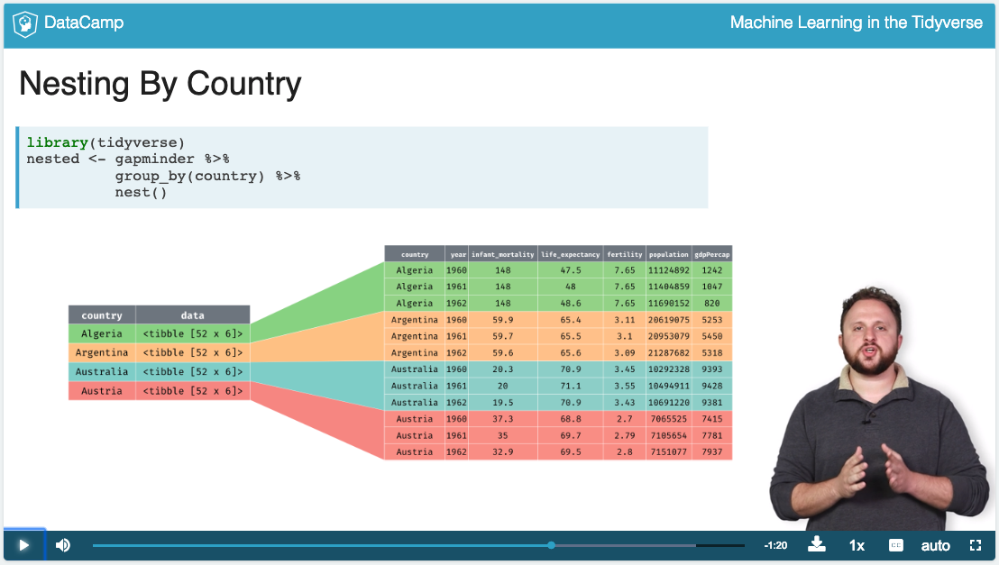
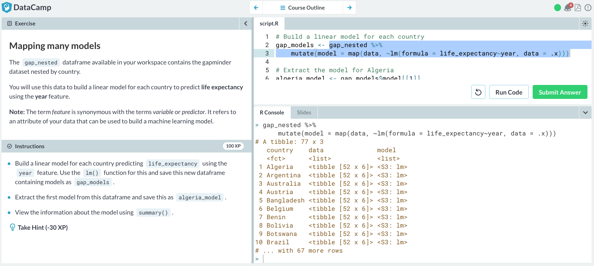

```{r, include=FALSE}
knitr::opts_chunk$set(echo=TRUE, message=FALSE, warning=FALSE, eval=FALSE, 
                      cache=TRUE, fig.width=16/2, fig.height=9/2)
# Set seed value of random number generator to get "replicable" random numbers.
# Why 76? Because of https://www.youtube.com/watch?v=xjJ7FheCkCU
set.seed(76)
```

<style>
h1{font-weight: 400;}
</style>

<!--
{target="_blank"}
-->


***


# Wed 2/6 1pm

Complete all 4 Chapters of ["Modeling with Data in the Tidyverse"](https://www.datacamp.com/courses/modeling-with-data-in-the-tidyverse){target="_blank"}


***


# Wed 2/27 1pm

From the ["Machine Learning in the Tidyverse"](https://www.datacamp.com/courses/machine-learning-in-the-tidyverse){target="_blank"} course complete:

* Chapter 1: "Foundations of "tidy" Machine learning".
* Chapter 2: "Multiple Models with broom"

Hints:

* I'm estimating most people to complete both these chapters in two hours or less. 
* In Chapter 1 Dmitriy introduces a new kind of data structure: a "tibble" data frame with _list columns_. This of this as a data frame where the cells are no longer individual values, but rather "nested" data frames/lists of values.  
{ width=700px }
* In order to work with such list columns, we need to use the map function from `purrr` package, which gets loaded whenever you run `library(tidyverse)`.  
{ width=150px }
* In Chapter 2 Dmitriy uses the `broom` package which we've seen a few times in class so far to take "fitted model objects" and return data frames of different types.  
{ width=150px }
* The ideas in this course are very cleanly and compactly explained IMO. However, because they are so cleanly and compactly explained, the ideas are very dense. I highly recommend that you consider running code in bits and pieces instead of running the whole thing at once.
* For example in the image below I highlighted a small segment of code and ran it in the console by clicking command + enter (macOS) or control + enter if I were on Windows/unix/chromebook. That way I can dissect all steps in producing the output; open the image in a new tab if the font is too small.
{ width=700px }


***


# Wed 3/20 1pm

From the ["Machine Learning in the Tidyverse"](https://www.datacamp.com/courses/machine-learning-in-the-tidyverse){target="_blank"} course complete:

* Chapter 3: "Build, Tune & Evaluate Regression Models"
* Chapter 4: "Build, Tune & Evaluate Classification Models"


***


# Wed 4/24 1pm {#quiz}

In-class quiz based on two exercises meant to provide a "big-picture" look machine learning and its impact on society.

* The quiz is not meant to be difficult and taking notes are optional. As long as you make a good faith effort to both listen to the entire podcast and complete the Stitch Fix exercise in an undistracted manner, you will do fine. 
* We will have an in-class discussion about these two exercises after the quiz.
* For both the podcast and the Stitch Fix exercise
    + Try to view them through the lens of the modeling for machine learning framework: $y=f(\vec{x})+\epsilon$ and $\widehat{y}=\widehat{f}(\vec{x})$
    + Ask yourself: What are the models for machine learning predicting, but also what are they *reinforcing?*
* Disclosure: I'm not being compensated by StitchFix.


## Weapons of Math Destruction

Listen to [Econ Talk podcast](http://www.econtalk.org/archives/2016/10/cathy_oneil_on_1.html){target="_blank"} (time 1h11m) of interview with ["Weapons of Math Destruction"](https://weaponsofmathdestructionbook.com/){target="_blank"} author Cathy O'Neil.


## Stitch Fix

1. Go to [Stitch Fix](https://www.stitchfix.com/signup?bl=gn){target="_blank"} and sign-up to "Take your style quiz". If you are reluctant to use your own email, you may create a fake "burner" email at <https://maildrop.cc/>.
1. Take the women's style quiz.
1. Log out of Stitch Fix.
1. Go to [Stitch Fix](https://www.stitchfix.com/signup?bl=gn){target="_blank"} agin and sign-up to "Take your style quiz" using a different email. Again, you may create a fake "burner" email at <https://maildrop.cc/>.
1. Take the men's style quiz and **observe any differences** with the women's style quiz.

If you are unfamiliar with Stitch Fix's business model, watch this 4m video meant for consumption by a wide audience:

<a href="http://abcnews.go.com/Lifestyle/clothing-box-services-stitch-fix-wantable-dia/story?id=49794347">

</a>


