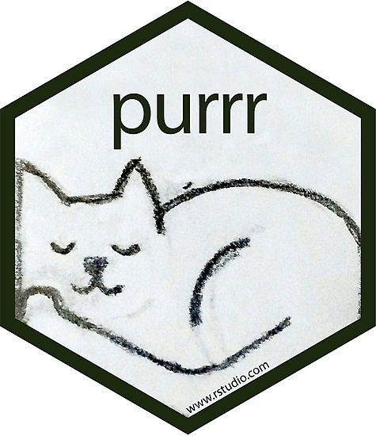
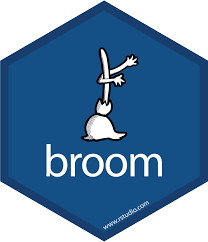

```{r, include=FALSE}
knitr::opts_chunk$set(echo=TRUE, message=FALSE, warning=FALSE, eval=FALSE, 
                      cache=TRUE, fig.width=16/2, fig.height=9/2)
# Set seed value of random number generator to get "replicable" random numbers.
# Why 76? Because of https://www.youtube.com/watch?v=xjJ7FheCkCU
set.seed(76)
```

<style>
h1{font-weight: 400;}
</style>

<!--
{target="_blank"}
-->


***


# Wed 2/6 1pm

Complete all 4 Chapters of ["Modeling with Data in the Tidyverse"](https://www.datacamp.com/courses/modeling-with-data-in-the-tidyverse){target="_blank"}


***


# Wed 2/27 1pm

From the ["Machine Learning in the Tidyverse"](https://www.datacamp.com/courses/machine-learning-in-the-tidyverse){target="_blank"} course complete:

* Chapter 1: "Foundations of "tidy" Machine learning".
* Chapter 2: "Multiple Models with broom"

Hints:

* I'm estimating most people to complete both these chapters in two hours or less. 
* In Chapter 1 Dmitriy introduces a new kind of data structure: a "tibble" data frame with _list columns_. This of this as a data frame where the cells are no longer individual values, but rather "nested" data frames/lists of values.  
{ width=700px }
* In order to work with such list columns, we need to use the map function from `purrr` package, which gets loaded whenever you run `library(tidyverse)`.  
{ width=150px }
* In Chapter 2 Dmitriy uses the `broom` package which we've seen a few times in class so far to take "fitted model objects" and return data frames of different types.  
{ width=150px }
* The ideas in this course are very cleanly and compactly explained IMO. However, because they are so cleanly and compactly explained, the ideas are very dense. I highly recommend that you consider running code in bits and pieces instead of running the whole thing at once. For example in the image below I highlighted a small segment of code and ran it in the console by clicking command + enter (macOS) or control + enter if I were on Windows/unix/chromebook (open the image in a new tab if the font is too small). That way I can dissect all steps. 
{ width=700px }


***


# Wed 3/20 1pm

From the ["Machine Learning in the Tidyverse"](https://www.datacamp.com/courses/machine-learning-in-the-tidyverse){target="_blank"} course complete:

* Chapter 3: "Build, Tune & Evaluate Regression Models"
* Chapter 4: "Build, Tune & Evaluate Classification Models"


