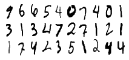
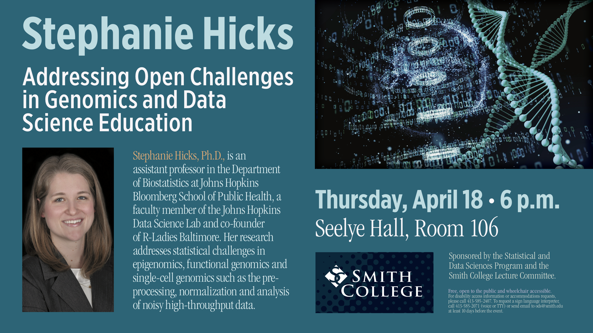
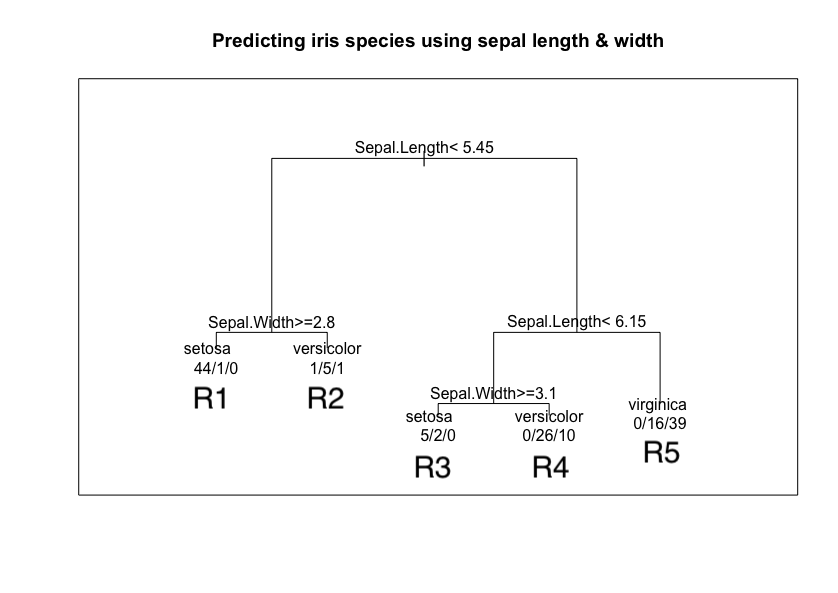
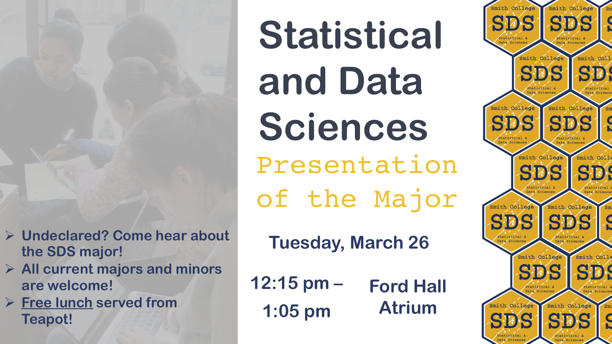
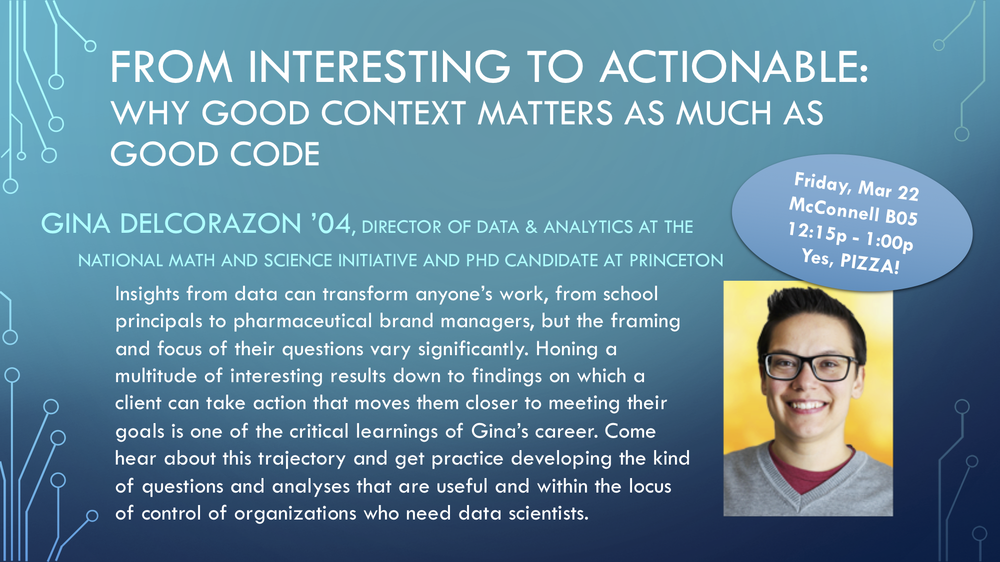
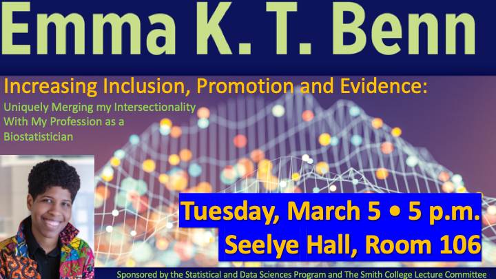
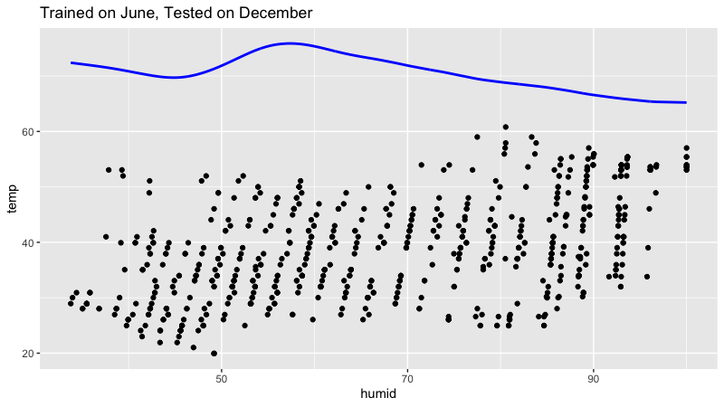
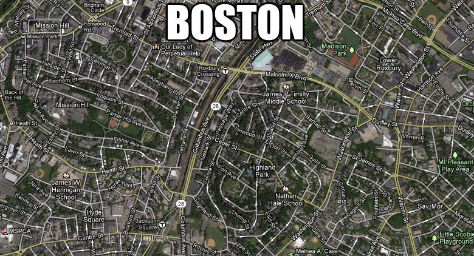
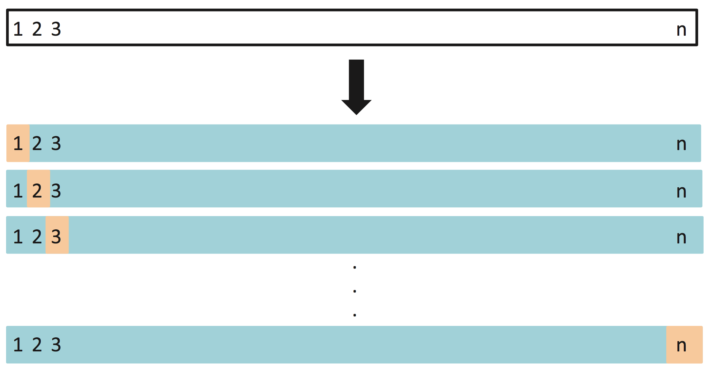
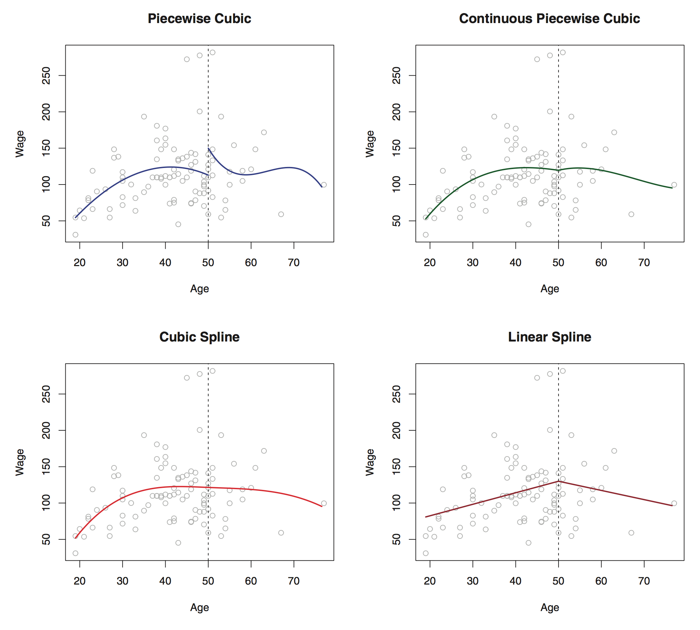

<style>
h1{font-weight: 400;}
</style>

```{r setup, include=FALSE}
knitr::opts_chunk$set(echo=TRUE, message=FALSE, warning=FALSE, eval=FALSE, 
                      cache=TRUE, fig.width=16/2, fig.height=9/2)
library(tidyverse)
library(broom)
library(knitr)
library(modelr)
library(lubridate)
library(forcats)
library(nycflights13)
# devtools::install_github("thomasp85/patchwork")
library(patchwork)
library(okcupiddata)
# devtools::install_github("hadley/emo")
library(emo)

# Set seed value of random number generator to get "replicable" random numbers.
# Why 76? Because of https://www.youtube.com/watch?v=xjJ7FheCkCU
set.seed(76)
```

```{r, eval=FALSE, echo=FALSE}
# Run this separately to have slide output:
rmarkdown::render("index.Rmd", output_format = c("ioslides_presentation"), output_file = "slides.html")
```

<style>
h1{font-weight: 400;}
</style>


***


# Schedule 

<iframe src="https://docs.google.com/spreadsheets/d/e/2PACX-1vToPV6gfDlIq5ni1qezMcPy3ZdyIN1MtSSKZ3GABeBvf9LYu3_1XE7DOEQh4Dg02bKG5YF0XpSFO_-B/pubhtml?gid=1068367544&amp;single=true&amp;widget=true&amp;headers=false" width="80%" height="600"></iframe>

<!--
{target="_blank"}
-->


***


# Lec 24: Wed 5/1

## Announcements

* Today's lecture: Final thoughts. Tomorrow's lecture: 80 minutes of office hours.
* Joint MP5 peer evaluation & exit survey [posted](MP.html#MP5-submit). All group members must complete this to receive full credit. In particular there are questions relating to use of Slack, because at the Symposium on Data Science and Statistics (SDSS) I'll be presenting ["Using Slack for Communication and Collaboration in the Classroom"](https://ww2.amstat.org/meetings/sdss/2019/onlineprogram/AbstractDetails.cfm?AbstractID=305068){target="_blank"}  
</br>
<center>
<a href="https://ww2.amstat.org/meetings/sdss/2019/onlineprogram/Program.cfm?TrackID=28" target="_blank"></a>
</center>
</br>
* FYI other SDS faculty will be presenting at SDSS as well:
    + Prof. Katherine Kinnaird: ["Data Physicalizations: Where Art, Data, and Domain Applications Combine"](https://ww2.amstat.org/meetings/sdss/2019/onlineprogram/AbstractDetails.cfm?AbstractID=305072){target="_blank"}
    + Prof. Miles Ott: ["Ethics in an Advanced Undergraduate Seminar: Statistical Analysis of Social Network Data"](https://ww2.amstat.org/meetings/sdss/2019/onlineprogram/AbstractDetails.cfm?AbstractID=305016){target="_blank"}


## Todays Topics/Activities  

[HTML Solutions](static/MP4_solutions.html){target="_blank"} to MP4 posted as well as [`.Rmd` source code](MP.html#MP4-solutions). Things to note:

1. Figure 1: Plot of $y$ = estimated accuracy over $x$ = $\alpha$ complexity parameter
    * Why does it look like steps and not a smooth curve like with previous MSE vs complexity plots?
    * What is "optimal" $\alpha^*$ when many values of $\alpha$ achieve the same "best" accuracy of 69.2%
    * Compare the crossvalidated estimate of accuracy of using default $\alpha$ = 0.01 of 69.2%, to the accuracy of 80.3% you got in the "Due Dilligence" phase when not performing crossvalidation.
    * In other words, if you don't do CV, due to overfitting your uncrossvalidated classification accuracy is incorrectly "overly optimistic": your accuracy on "new" data is actually much worse!
    * Recall [Lec01 Slide 36](http://rudeboybert.rbind.io/talk/2019-01-13-Williams.pdf#page=36){target="_blank"}
1. Figure 2: Why does tree using only one-hot-encoded color variables only split on one variable: "is clear"?


### 1. In-class exercise

Work on MP5.


***


# Lec 23: Mon 4/29

## Announcements

* Wrap-up
* [Midterm II Q3 resubmission](midterms.html#revise) due today. You must follow instructions completely to
receive full credit. 


## Todays Topics/Activities  

### 1. Chalk Talk: Major topics we didn't cover

1. Image recognition: [Google Quick, Draw](https://quickdraw.withgoogle.com/){target="_blank"}.
1. "Unsupervised learning" where there is no outcome variable $y$:
    a) Clustering. Ex: k-means clustering [PDF](static/methods/k_means/k_means.pdf){target="_blank"} and <a href="static/methods/k_means/k_means_plots.R" download>source code</a>.
    a) Principal components analysis (PCA)
        + Simple example: [School funding](static/methods/PCA/PCA.html){target="_blank"} and <a href="static/methods/PCA/PCA.Rmd" download>source code</a>.
        + Facial recognition example: <a href="static/methods/PCA/faces.csv.zip" download>data</a> and <a href="static/methods/PCA/PCA.R" download>`PCA.R`</a> code
1. Bias-variance tradeoff. Why do observe this pattern in the "Total Error" black curve below, which is a fitted model's error on new test data for different levels of model complexity?

<a href="http://scott.fortmann-roe.com/docs/BiasVariance.html" target="_blank"></a>

Because of this probabilistic formula

$$
\mbox{MSE}\left[\widehat{f}(x)\right] = \mbox{Var}\left[\widehat{f}(x)\right] +
\left(\mbox{Bias}\left[\widehat{f}(x)\right]\right)^2 + \sigma^2
$$

where:

* $\widehat{y}$ is also denoted $\widehat{f}(x)$. $\widehat{f}(x)$ is a random variable.
* $y=f(x)+\epsilon$ with $\mathbb{E}\left[\epsilon\right] = 0$ and $\mbox{Var}[\epsilon] = \sigma$. Hence $y$ is random as well.
* The random variation is over sample to sample.

Why is this true? You need to take MTH/SDS 246 Probability:

$$
\begin{aligned}
\mbox{MSE}\left[\widehat{f}(x)\right] &= \mathbb{E}\left[\left( y - \widehat{f}(x) \right)^2\right]= \mathbb{E}\left[\left( y^2 - 2 y\widehat{f}(x) + \widehat{f}(x)^2 \right)\right]\\
&= \left( \mathbb{E}\left[ y^2 \right]\right) + \left(\mathbb{E}\left[ \widehat{f}(x)^2 \right]\right) - \left(\mathbb{E}\left[ 2y\widehat{f}(x) \right]\right) \mbox{ by linearity of expectations } \\
&= \left( \mathbb{E}\left[ y^2 \right]\right) + \left(\mathbb{E}\left[ \widehat{f}(x)^2 \right]\right) - \left(\mathbb{E}\left[ 2(f(x)+\epsilon)\widehat{f}(x) \right]\right) \mbox{ since } y = f(x)+\epsilon\\
&= \left( \mathbb{E}\left[ y^2 \right]\right) + \left(\mathbb{E}\left[ \widehat{f}(x)^2 \right]\right) - \left(\mathbb{E}\left[ 2f(x)\widehat{f}(x) \right] + \mathbb{E}\left[ 2\epsilon\widehat{f}(x) \right]\right)  \\
&= \left( \mathbb{E}\left[ y^2 \right]\right) + \left(\mathbb{E}\left[ \widehat{f}(x)^2 \right]\right) - 2f(x)\mathbb{E}\left[ \widehat{f}(x) \right] - 2\mathbb{E}\left[ \epsilon\widehat{f}(x) \right]  \mbox{ since } \mathbb{E}\left[aX\right] = a\mathbb{E}\left[X\right] \mbox{ for } a \in \mathbb{R}\\
&= \left( \mathbb{E}\left[ y^2 \right]\right) + \left(\mathbb{E}\left[ \widehat{f}(x)^2 \right]\right) - 2f(x)\mathbb{E}\left[ \widehat{f}(x) \right] - 2\mathbb{E}\left[\epsilon \right]\mathbb{E}\left[\widehat{f}(x) \right] \mbox{ since } \mathbb{E}\left[XY\right] = \mathbb{E}\left[X\right]\mathbb{E}\left[Y\right] \mbox{ if }X,Y \mbox{ are independent}\\
&= \left( \mathbb{E}\left[ y^2 \right]\right) + \left(\mathbb{E}\left[ \widehat{f}(x)^2 \right]\right) - 2f(x)\mathbb{E}\left[ \widehat{f}(x) \right] - 0 \mbox{ since } \mathbb{E}\left[\epsilon\right]=0\\
&= \left( \mbox{Var}\left[ y \right] + \mathbb{E}\left[y\right]^2 \right) + \left(\mbox{Var}\left[ \widehat{f}(x) \right] + \mathbb{E}\left[ \widehat{f}(x) \right]^2\right) - 2f(x)\mathbb{E}\left[ \widehat{f}(x) \right] \mbox{ since } \mbox{Var}\left[X\right] = \mathbb{E}\left[X^2\right] - \mathbb{E}\left[X\right]^2\\
&= \left( \mbox{Var}\left[ y \right] + \mathbb{E}\left[f(x) + \epsilon\right]^2 \right) + \left(\mbox{Var}\left[ \widehat{f}(x) \right] + \mathbb{E}\left[ \widehat{f}(x) \right]^2\right) - 2f(x)\mathbb{E}\left[ \widehat{f}(x) \right]\\
&= \left( \mbox{Var}\left[ y \right] + \mathbb{E}\left[f(x)\right]^2 + 0 \right) + \left(\mbox{Var}\left[ \widehat{f}(x) \right] + \mathbb{E}\left[ \widehat{f}(x) \right]^2\right) - 2f(x)\mathbb{E}\left[ \widehat{f}(x) \right] \mbox{ since } \mathbb{E}\left[\epsilon\right] = 0\\
&= \mbox{Var}\left[ y \right] + \mbox{Var}\left[ \widehat{f}(x) \right] + \left( f(x)^2  -  2f(x)\mathbb{E}\left[ \widehat{f}(x) \right] + \mathbb{E}\left[ \widehat{f}(x) \right]^2 \right)\\
&= \mbox{Var}\left[ y \right] + \mbox{Var}\left[ \widehat{f}(x) \right] + \left(  f(x) - \mathbb{E}\left[\widehat{f}(x) \right] \right)^2 \\
&= \mbox{Var}\left[ y\right] + \mbox{Var}\left[ \widehat{f}(x) \right] + \left(  \mathbb{E}\left[f(x)-\widehat{f}(x) \right] \right)^2 \mbox{ since } \mathbb{E}\left[a + X \right] = a + \mathbb{E}\left[X\right] \mbox{ for } a \in \mathbb{R}\\
&= \sigma^2 + \mbox{Var}\left[ \widehat{f}(x) \right] + \left( \mbox{Bias}\left[ \widehat{f}(x) \right] \right)^2 \mbox{ since } \mbox{Var}\left[ y\right] = \mbox{Var}\left[ f(x)+\epsilon\right] = \mbox{Var}\left[ \epsilon \right] = \sigma^2\\
\end{aligned}
$$


### 2. Chalk Talk: Neural nets

Based on this [link](http://neuralnetworksanddeeplearning.com/chap1.html){target="_blank"}, the best layperson's explanation of neural nets I could find. Other references:

* [Deep Learning with R](https://www.amazon.com/Deep-Learning-R-Francois-Chollet/dp/161729554X){target="_blank"}, which uses the `keras` package.
* The `keras` package is included in RStudio's [R Interface to Core TensorFlow API](https://tensorflow.rstudio.com/tensorflow/){target="_blank"}.
* [TensorFlow](https://www.tensorflow.org/){target="_blank"} is Google Brain's open-source library for machine learning applications such as neural networks.
* TensorFlow is one of the elements behind [AlphaGo](https://ai.googleblog.com/2016/01/alphago-mastering-ancient-game-of-go.html){target="_blank"}:

<iframe width="560" height="315" src="https://www.youtube.com/embed/8tq1C8spV_g" frameborder="0" allow="accelerometer; autoplay; encrypted-media; gyroscope; picture-in-picture" allowfullscreen></iframe>

</br>


### 3. Example of Deep Learning

Amherst College '18 graduate and [MassMutual Data Science Development Program](https://datascience.massmutual.com/dsdp){target="_blank"} member Jennifer Halbleib's thesis: [PDF](static/halbleib.pdf){target="_blank"} and `thesisdown` R Markdown <a href="static/halbleib.zip" download>source code</a>. Data considered is famous [MNIST handwritten digit data](https://en.wikipedia.org/wiki/MNIST_database){target="_blank"}, available on [Kaggle](https://www.kaggle.com/c/digit-recognizer){target="_blank"}.

<a href="https://www.kaggle.com/c/digit-recognizer" target="_blank"></a>


***


# Lec 22: Wed 4/24

## Announcements

None.

## Todays Topics/Activities  

### 1. In-class exercise

* Ethics in machine learning discussion. All comments + links posted in `#ethics_discussion` channel in Slack.


***


# Lec 21: Mon 4/22

## Announcements

* [Instructions](midterms.html#revise) on revising/resubmitting question 3 of midterm II only. 
* Wed 4/24:
    + In-class quiz (info posted in [DataCamp](datacamp.html#quiz)) followed by discussion of ethics in machine learning.
    + Wrap-up discussion:
        + What we didn't cover in this course.
        + What to remember for future.
    + No office hours during normal 2:45-4pm slot.
* MP5 [posted](MP.html#MP5). Please fill out your group information/partner requests today if possible.


## Todays Topics/Activities  

### 1. In-class exercise

* Go over LASSO example [code](code.html#LASSO).

### 2. Tweet of the day

<blockquote class="twitter-tweet" data-lang="en"><p lang="en" dir="ltr">We heard you like R so we made a wine called R so you can drink R while you R <a href="https://t.co/D6cPTHEdq6">pic.twitter.com/D6cPTHEdq6</a></p>&mdash; R Memes for Statistical Fiends (@rstatsmemes) <a href="https://twitter.com/rstatsmemes/status/1117231358143864832?ref_src=twsrc%5Etfw">April 14, 2019</a></blockquote>
<script async src="https://platform.twitter.com/widgets.js" charset="utf-8"></script>


***


# Lec 20: Wed 4/17

## Announcements

* Midterms back on Monday or your each get $10.
* Preliminary info about MP5 posted. You are free to choose groups of 2-3. 

## Todays Topics/Activities  

### 1. In-class exercise

Work on MP4.


***


# Lec 19: Mon 4/15

## Announcements

* Posted information on in-class quiz on Wed 4/24 in [DataCamp](datacamp.html#quiz). This quiz will count as a DataCamp assignment. 
* Discussion about DataCamp.

## Todays Topics/Activities  

### 1. Chalk Talk

* Continuing: Shiny app illustrating how to control the amount of "regularization/shrinkage" in a multiple regression model <a href="static/methods/LASSO/LASSO_v2.Rmd" download>`LASSO_v2.Rmd`</a>.
* Explaining the optimization inherent to LASSO:* LASSO uses a class of [gradient descent](https://en.wikipedia.org/wiki/Gradient_descent){target="_blank"} optimization methods called [proximal gradient methods](https://en.wikipedia.org/wiki/Proximal_gradient_methods_for_learning#Lasso_regularization){target="_blank"} to find the $\widehat{\beta}_0$ and $\widehat{\beta}_1, \ldots, \widehat{\beta}_p$ that minimizes the following equation:

$$
\min_{\widehat{\beta}_0, \ldots, \widehat{\beta}_p} \left( \sum_{i=1}^n \left(y_i -\widehat{y}_i\right)^2 + \lambda \sum_{j=1}^p \left|\widehat{\beta}_j\right| \right)
$$

in other words find the $\widehat{\beta}_0$ and $\widehat{\beta}_1, \ldots, \widehat{\beta}_p$ that minimizes

$$
\min_{\widehat{\beta}_0, \ldots, \widehat{\beta}_p} \left( \mbox{residual sum of squares} + \mbox{shrinkage penalty} \right)
$$

Note that the "residual sum of squares" is inversely related to the "shrinkage penalty". 

### 2. In-class exercise

Work on MP4.


***


# Lec 18: Mon 4/8

## Announcements

* (More straight-forward) [MP4 posted](MP.html#MP4)
* Talk on Thursday April 18th 6pm in Seelye 106  
<center>
{ width=650px }
</center>

## Todays Topics/Activities  

### 1. Chalk Talk

* Just like CART, the $k$-Nearest Neighbors (kNN) "partitions" the predictor space. This time not with "binary splits" but by dividing up the predictor space based on proximity. See this [sequence of images](static/methods/knn/knn_all_plots.pdf){target="_blank"}.
    + Optional: [Additional reading on knn](http://scott.fortmann-roe.com/docs/BiasVariance.html){target="_blank"}
    + Optional: Shiny app <a href="static/methods/knn/knn.Rmd" download>`knn.Rmd`</a>
* Shiny app illustrating how to control the amount of "regularization/shrinkage" in a multiple regression model <a href="static/methods/LASSO/LASSO_v2.Rmd" download>`LASSO_v2.Rmd`</a>. 


***


# Lec 17: Wed 4/2

## Announcements

* If you are interested in being hired to be a note taker for this class, please see the message in `#general` on Slack.
* Extra office hours this Friday: 2:30pm-4:00pm.

## Todays Topics/Activities  

### How CART partitions the predictor space, Take 2

Recall from Lec14 Chalk Talk the drawings of regions R1, R2, R3, R4, and R5 based on splits t1, t2, t3, and t4 drawings? Those were a first attempt at illustrating the idea of "partitioning the predictor space", where in the drawings the predictor space (x1, x2) was two dimensional. 

Those were a little abstract. Here is a second attempt where we 

1. Show the tree first! Not second! Then
1. Show the corresponding scatterplot where we make the two dimensional predictor space explicit:  (x1 = Sepal Length, x2 = Sepal Width). Notice how the color of the points in each of the 5 regions corresponds to the terminal nodes/leafs of the tree.

{ width=500px }

```{r, echo = FALSE, eval = TRUE, fig.width=6.5}
# Figure from Lec
region_labels <- tibble(
  Sepal.Length = c(4.5, 4.5, 7, 5.95, 5.7),
  Sepal.Width = c(4.4, 2.1, 4.4, 4.4, 2.1),
  label = c("R1", "R2", "R5", "R3", "R4")
)

iris %>%
  # Convert to tibble data frame:
  as_tibble() %>%
  # Add identification variable to uniquely identify each row:
  rownames_to_column(var="ID") %>% 
  ggplot(aes(x=Sepal.Length, y = Sepal.Width)) +
  geom_jitter(aes(col = Species)) +
  annotate("segment", x = 5.45, xend = 5.45, y = 2, yend = 4.5, size = 1) +
  annotate("segment", x = 4, xend = 5.45, y = 2.8, yend = 2.8, size = 1) +
  annotate("segment", x = 6.15, xend = 6.15, y = 2, yend = 4.5, size = 1) +
  annotate("segment", x = 6.15, xend = 5.45, y = 3.1, yend = 3.1, size = 1) +
  geom_text(data = region_labels, aes(label = label), size = 10) +
  labs(x = "x1: Sepal Length", y = "x2: Sepal Width",
       title = "Jittered scatterplot of CART", col = "y: Species")
```


### 1. Chalk Talk

* Shiny app illustrating how to control "complexity" of a tree <a href="static/methods/CART/CART.Rmd" download>`CART.Rmd`</a>. 


***


# Lec 16: Mon 4/1

## Announcements

* Midterm II this weekend. Review materials under [Midterms](midterms.html#midtermII)

## Todays Topics/Activities  

### 1. Chalk Talk

* [MP3 solutions](MP.html#MP3-solutions)
* Wrapping up CART
    + What is multiclass logarithmic loss? A simple example
    + Please review on your own: Solutions for Lec 14 CART code exercises. These can be found in [Code](code.html) -> CART -> Lines 116-154.    


### 2. Tweet of the day

<blockquote class="twitter-tweet" data-lang="en"><p lang="en" dir="ltr">👏Give me an E👏! ... E!<br>👏Give me a D👏! ... D!<br>👏Give me an A👏! ... A!<br>What does that spell? Exploratory data analysis! 👏👏👏 <a href="https://t.co/FuUKZxH0Vk">https://t.co/FuUKZxH0Vk</a></p>&mdash; Albert Y. Kim (@rudeboybert) <a href="https://twitter.com/rudeboybert/status/1110897733177671680?ref_src=twsrc%5Etfw">March 27, 2019</a></blockquote>
<script async src="https://platform.twitter.com/widgets.js" charset="utf-8"></script>


***


# Lec 15: Wed 3/27

## Announcements

*

## Todays Topics/Activities  

### 1. Chalk Talk

* What is a "minimally **REPR**oducible **EX**ample" AKA a [reprex](https://www.tidyverse.org/help/){target="_blank"}?


### 2. In-class exercise

* MP3 now due at 10pm (as well as MP4 & MP5). 
* Note reprex of AUC computation on [MP3](MP.html#MP3-working) page.


***


# Lec 14: Mon 3/25

## Announcements

* Sit with your MP3 partner
* Tomorrow 12:15-1:05pm in Ford Hall Atrium: Presentation of SDS major
<center>
{ width=650px }
<center>
</br>
    

## Todays Topics/Activities  

### 1. iris dataset

The iris dataset is a canonical dataset in statistics and machine learning ([Wikipedia](https://en.wikipedia.org/wiki/Iris_flower_data_set)). Introduced by Fisher in his 1936 paper "The use of multiple measurements in taxonomic problems as an example of linear discriminant analysis." For 150 iris flowers it has

**Categorical outcome $y$**: One of three species of iris flower

Setosa            |  Versicolor |  Virginica
:-------------------------:|:-------------------------:|:-------------------------:
  |    |  

**Four predictor variables $\vec{X}$**: Sepal length, sepal width, petal length, and petal width, all in cm.

<center></center>

```{r, eval = TRUE}
library(tidyverse)
iris <- iris %>%
  # Convert to tibble data frame:
  as_tibble() %>% 
  # Add identification variable to uniquely identify each row:
  rownames_to_column(var="ID") 

# Show random sample of 5 rows:
iris %>% 
  sample_n(5)
```

### 2. Chalk Talk

Classification and Regression Trees (CART) are trees.
    + "Classification" when outcome variable $y$ is categorical
    + "Regression" when outcome variable $y$ is numerical


### 3. In-class exercise

* See [Code](code.html) for CART


***


# Lec 13: Wed 3/20

## Announcements

* No office hours today. I do however have appointments to book on Friday (see syllabus for link, appointment slots vary each week).
* ROC curve shiny app. Please:
    + Delete the `ROC.Rmd` file to generate the interactive Shiny App for ROC curves I shared over Slack on Monday 3/18.
    + Replace it with this <a href="static/methods/ROC/ROC_v2.Rmd" download>`ROC_v2.Rmd`</a> updated-and-improved version!
    

## Todays Topics/Activities  

### 1. In-class exercise

* Work on MP3
* See added grading rubric and clarifications for [MP3](MP.html#MP3)


***


# Lec 12: Mon 3/18

## Announcements

* Two events coming up:
    + Fri 3/22 12:15-1:00pm in McConnell B15: Gina DelCorazon '04, Director of Data & Analytics at The National Math and Science Initiative
    + Tue 3/26 12:15-1:05pm in Ford Hall Atrium: Presentation of SDS major

<center>
{ width=650px }
<center> 

</br>

 
## Todays Topics/Activities  

### 1. Chalk Talk

* Scores/measures for binary outcome variables
* ROC curves


### 2. Tweet of the Day

Even though the `yardstick` package already existed, the developers of `tidyroc` know that they still learned a ton about R package developement. They will leverage these new skills for their next project! 

**Moral of the story**: Turn your disappointments into your next success! From Dariya Sydykova's blog post:

> In conclusion, I do not regret the time and effort it took me to work on `tidyroc`... As a believer in the growth mindset, I like to focus on the things that I have learned and on the ways that I have improved myself. I got to implement `devtools`, `usethis`, and `roxygen2` and to learn a little more about how these work.

<blockquote class="twitter-tweet" data-conversation="none" data-lang="en"><p lang="en" dir="ltr"><a href="https://twitter.com/ClausWilke?ref_src=twsrc%5Etfw">@ClausWilke</a> and I decided that we will not be developing <a href="https://twitter.com/hashtag/tidyroc?src=hash&amp;ref_src=twsrc%5Etfw">#tidyroc</a> any further. We were informed about an R package <a href="https://twitter.com/hashtag/yardstick?src=hash&amp;ref_src=twsrc%5Etfw">#yardstick</a> that calculates ROC curves, and it is integrated with the <a href="https://twitter.com/hashtag/tidyverse?src=hash&amp;ref_src=twsrc%5Etfw">#tidyverse</a>. See my blog post for more details:<a href="https://t.co/raWMstEZy6">https://t.co/raWMstEZy6</a></p>&mdash; Dariya Sydykova (@dariyasydykova) <a href="https://twitter.com/dariyasydykova/status/1105960285947523077?ref_src=twsrc%5Etfw">March 13, 2019</a></blockquote>
<script async src="https://platform.twitter.com/widgets.js" charset="utf-8"></script>


***


# Lec 11: Wed 3/6

## Announcements

* Spinelli Center tutoring hours change tomorrow (Thursday 3/7) only: 4:30-6pm and not ~~7-9pm~~.

## Todays Topics/Activities  

### 1. Chalk Talk

* Finishing logistic regression

### 2. In-class exercise

* Work on MP2


***


# Lec 10: Mon 3/4

## Announcements

* Reminder tomorrow is: 

<center>
{ width=650px }
<center> 

<br>

## Todays Topics/Activities  

### 1. Chalk Talk

* Intro to logistic regression
* Transforming probability space to log-odds/logit space. The following two plots are the same but with the axes flipped. In other words:
    + The left plot visualizes how we map from probability space $[0,1]$ to log-odds space $(-\infty, \infty)$
    + The right plot visualizes how we map from log-odds space $(-\infty, \infty)$ back to probability space $[0,1]$
* [Code](code.html)

<!--
Here are the two equations:

$$
\begin{align}
\mbox{left function} = \mbox{log-odds} = \mbox{logit}(p) &= \log\left(\frac{p}{1-p}\right) = \alpha\\
\mbox{right function} = \mbox{inverse-logit}(\alpha) &= \frac{\exp(\alpha)}{\exp(\alpha) + 1} = \frac{1}{1+ \exp(-\alpha)} = p
\end{align}
$$
--> 

```{r, echo=FALSE, eval=TRUE}
eps <- 0.0001
values <- tibble(
  p = seq(from = eps, to = 1-eps, length = 1000),
  y = log(p/(1-p))
)
points <- tibble(
  p = c(0.01, 1-0.01, 0.5),
  y = log(p/(1-p)),
  group = factor(1:3)
)

plot1 <- ggplot(values, aes(p, y)) +
  geom_line() +
  geom_hline(yintercept = 0,  alpha=0.5) +
  geom_vline(xintercept = 0.5, alpha=0.5) +
  # geom_vline(xintercept = 0, linetype="dashed", alpha=0.5) +
  # geom_vline(xintercept = 1, linetype="dashed", alpha=0.5) +
  geom_point(data=points, aes(col=group), size=5) + 
  theme(legend.position="none") +
  labs(x="Probability p", y="log-odds", title="log-odds over probability")
plot2 <- plot1 +
  coord_flip() + 
  labs(x="Probability p", y="log-odds", title="probability over log-odds")
plot1 + plot2
```


### 2. In-class exercise

* Work on MP2


***


# Lec 9: Wed 2/27

## Announcements

* As indicated in the [syllabus](syllabus.html#policies), even if you are done any in-class exercises early, please remain until the end of lecture. It is very disruptive to the class if you pack up and leave early. 
* MP2 posted.


## Todays Topics/Activities  

### 1. Chalk Talk

* Start MP2 today.
* We'll go solutions to Lec 8 regression exercises and start logistic regression during the first half of Monday's lecture.


***


# Lec 8: Mon 2/25

## Announcements

* MP1 grades on Wednesday
* MP2 assigned on Wednesday. It will involve regression modeling on house price data again.


## Todays Topics/Activities  

### 1. Chalk Talk

* Regression
* See [code](code.html#regression)

### 2. Tweet of the day

Dr. Benn is excited for her talk at Smith College SDS. **Are you?**

<blockquote class="twitter-tweet" data-lang="en"><p lang="en" dir="ltr">Yessss!!! Definitely looking forward to speaking with and learning from the amazing <a href="https://twitter.com/SmithCollegeSDS?ref_src=twsrc%5Etfw">@SmithCollegeSDS</a> faculty and students! 🤗💃🏾🤗💃🏾 <a href="https://t.co/te01giEvXv">https://t.co/te01giEvXv</a></p>&mdash; Emma Benn (@EKTBenn) <a href="https://twitter.com/EKTBenn/status/1098396480719572993?ref_src=twsrc%5Etfw">February 21, 2019</a></blockquote>
<script async src="https://platform.twitter.com/widgets.js" charset="utf-8"></script>


***


# Lec 7: Mon 2/18

## Announcements

* Wednesday 2/20 is Rally Day: no lecture nor office hours. 
* Extra office hours Friday 2/22 3:00pm-4:15pm.
* Midterm I discussion

## Todays Topics/Activities  

### 1. Chalk Talk

* MP1 discussion


***


# Lec 6: Wed 2/13

## Announcements

Before Lec07 on Monday 2/18:  

* I will post ~~solutions~~ one of many possible approaches to doing `MP1.Rmd` in the [Mini-Projects](MP.html) page by Friday afternoon. Please read these.
* Delete the minimally viable `regression.Rmd` file I sent on Slack during Lec05 on Monday, replace it with this improved file <a href="static/methods/regression/regression_v2.Rmd" download>`regression_v2.Rmd`</a>, and please read it.

Also, I fixed the error in Lec03 exercises solutions in [Code](code.html) page. The issue was inconsistent converting from &deg;F to &deg;C in all `training` and `test` sets; I commented all such code out. The correct visualization of a spline model "trained on June and predicting December temperatures" is below. Observe that the predictions (in blue) overpredict the actual December temperatures (black dots).

{ width=600px }

Remember:

> For your predictions to be valid, the data used to train your model must be at least somewhat representative of the test data you're making predictions on!

In other words:

If you only train your self-driving car here:  | Don't expect it to drive well here:
:-------------------------:|:-------------------------:
{ height=1.71.7in }  |  { height=1.7}


## Todays Topics/Activities  

### 1. Chalk Talk

Brief discussion on "looking at your data" inspired by tweet of the day below.

### 2. Tweet of the day

Why is important to `glimpse()` and `View()` your data frames? Because **looking at your data** is so deceptively simple that many people forget or ignore this step, even analysts/engineers with PhD's at Google! Before any modeling, you must getting a sense of:

1. **What types of variables you have in your columns?** Numerical, categorical, text, dates?
1. **What values you have in your cells?** Units of any measurements?
1. **What is the quality of your data?** Do you have missing data? Are there crazy outliers?

These are the most fundamental steps to take before any modeling or data analysis!  

<blockquote class="twitter-tweet" data-lang="en"><p lang="en" dir="ltr">Shout-out to people like me who like taking a look at even huge tables of raw data before summarizing or transforming, to get a sense of what&#39;s in there and spot potential data quality issues. Step 1 in data exploration! <a href="https://t.co/wVLHWcVNWA">pic.twitter.com/wVLHWcVNWA</a></p>&mdash; Data Science Renee (@BecomingDataSci) <a href="https://twitter.com/BecomingDataSci/status/1095421569428529153?ref_src=twsrc%5Etfw">February 12, 2019</a></blockquote>
<script async src="https://platform.twitter.com/widgets.js" charset="utf-8"></script>


***


# Lec 5: Mon 2/11

## Announcements

* Slack `#general` announcement about new `#mp1` channel. It is your responsibility to stay on top of all messages sent in this channel.
* Added clarification on what external sources you can use in [MP1 project instructions](MP.html#MP1-working).
* Wednesday's lecture is devoted to working on MP1


## Todays Topics/Activities  

### 1. Chalk Talk

* Discussion of solutions to Lec03 code exercises.
* Recap of Lec04: crossvalidation
* Regression

### 2. Tweet of the day {#work-life-balance}

Shared with me by Dr. Jenny Smetzer. I agree with Ms. Damour's opinion.  You don't have to, but her ideas are still worth thinking about. They relate to "points of diminishing returns" and "polishing the cannonball" as discussed for mini-project 1. Here are some excerpts:

* "Overqualified and overprepared, too many women still hold back. Women feel confident only when they are perfect." IMO this applies to more demographic groups than just women.
* "First, parents and teachers can stop praising inefficient overwork, even if it results in good grades."
* "A colleague of mine likes to remind teenagers that in classes where any score above 90 counts as an A, the different between a 91 and a 99 is a life." In other words, [work-life balance](syllabus.html#work-life-balance). 
<blockquote class="twitter-tweet" data-lang="en"><p lang="en" dir="ltr">Girls need to become tactical about school, to figure out how to get the same good grades, while doing a little bit less <a href="https://t.co/Achouetew6">https://t.co/Achouetew6</a></p>&mdash; NYT Opinion (@nytopinion) <a href="https://twitter.com/nytopinion/status/1093605420244049920?ref_src=twsrc%5Etfw">February 7, 2019</a></blockquote>
<script async src="https://platform.twitter.com/widgets.js" charset="utf-8"></script>


***


# Lec 4: Wed 2/6

## Announcements

* [DataFest](http://www.science.smith.edu/datafest/){target="_blank"} is a weekend-long "data science hackathon" for teams of up to 5 students and is at UMass the weekend of March 29-31! [Info session](static/other/datafest2019.pdf){target="_blank"} by Prof. Randi Garcia today 7-8pm in Sabin-Reed 301!
* "Multiple Imputation Methods in Cluster Randomzied Trials" talk by Prof. Brittney Bailey from Amherst College is tomorrow 12:10pm in McConnell B15. Free `r emo::ji("pizza")`!!!

<center>
{ width=600px }
</center>


## Todays Topics/Activities  

### 1. Chalk Talk

* Mini-project 1 is now assigned; see [Mini-Projects](MP.html) page.
* Recap of Lec03 + exercise solutions.
* Crossvalidation. See images:
    + **Image 1: Validation set approach**:  
    { width=500px }
    + **Image 2: k = 5 fold crossvalidation**:  
    { width=500px }
    + **Image 3: Leave-one-out crossvalidation (LOOCV)**:  
    { width=500px }


***


# Lec 3: Mon 2/4

## Announcements

* Slack: Go over `#questions`.
* Syllabus finalized
* Explanation of readings in schedule above.
* Mini-project 1 groups posted; see [Mini-Projects](MP.html) page. MP1 on splines itself will be assigned on Wednesday after we cover crossvalidation.


## Todays Topics/Activities  

### 1. Chalk Talk

* Recap of Lec02.
* Splines are piecewise continuous cubic polynomials with [smoothness](https://en.wikipedia.org/wiki/Smoothness) constraints (1^st^ and 2^nd^ derivatives are 0 at all knots) See bottom-left plot below.
* Optional reading only if you're curious: How are splines fit? Linear algebra! See page 93-94 of this [PDF](https://people.cs.clemson.edu/~dhouse/courses/405/notes/splines.pdf){target="_blank"}.

{ width=700px }


### 2. In-class exercise

Go over code for Lec03 and do the exercises.


### 3. Screencast on splines

The code this screencast was based on can be found [here](http://bit.ly/rudeboybert_splines){target="_blank"}.

<iframe width="560" height="315" src="https://www.youtube.com/embed/bESJ81dyYro" frameborder="0" allow="accelerometer; autoplay; encrypted-media; gyroscope; picture-in-picture" allowfullscreen></iframe>


***


# Lec 2: Wed 1/30

## Announcements

* Slack: Vote in two latest `#polls` and go over `#questions`.
* Go over updated schedule above, in particular "Important Dates"
* DataCamp "Modeling with Data in the tidyverse" assigned:
    + Make sure you can see the class DataCamp group by clicking [here](https://www.datacamp.com/enterprise/2019-01-machine-learning-293){target="_blank"}. If you cannot, then read the Google Doc in Lec01
    + Due Wed 2/6 at 1pm. Should take about 4 hours.
    + Only thing that is graded is whether you complete it, not the number of points. 
    + This assumes familiarity with the `tidyverse` suite of R packages; see the December email in the Google Doc in Lec01.
    + The DataCamp course builds up to Chapter 4's "Validation set prediction framework"


## Todays Topics/Activities  

### 1. Chalk Talk

* Recap of Lec01: $f(\vec{x})$ and $\hat{f}(\vec{x})$
* Based on code for `Lec02` posted in [Code](code.html) tab of menu bar for course webpage.
* Check out [House Prices: Advanced Regression Techniques](https://www.kaggle.com/c/house-prices-advanced-regression-techniques){target="_blank"} Kaggle competition.
* **Added after lecture**: Link to ModernDive chapter with an example on [logarithmic transformations](https://moderndive.netlify.com/12-thinking-with-data.html#log10-transformations){target="_blank"}. You'll also be seeing log-transformations in this week's DataCamp assignment!

### 2. Tweet of the day

This class is just part of a larger phenomenon of resources spread *very* thin:

<blockquote class="twitter-tweet" data-lang="en"><p lang="en" dir="ltr">On campuses across America, the surge in student demand for computer science courses is far outstripping the supply of professors <a href="https://t.co/9dwUMZ0eg8">https://t.co/9dwUMZ0eg8</a></p>&mdash; The New York Times (@nytimes) <a href="https://twitter.com/nytimes/status/1088440053796356107?ref_src=twsrc%5Etfw">January 24, 2019</a></blockquote>
<script async src="https://platform.twitter.com/widgets.js" charset="utf-8"></script>


***


# Lec 1: Mon 1/27

## Announcements

* If you haven’t already, please go over the following [Google Doc](https://docs.google.com/document/d/1NfWkoyeiovkVyMmgmKFGxCMusyxBMYHVvsAUjEZv_fU/){target="_blank"} with important information about the course and steps you should complete to get setup, in particular the Intro Survey. The whole process should take about 20 minutes.
* **Added on Sun 1/27 6PM**: Create an account on Kaggle.com using your Smith (or Five College) email address. 


## Todays Topics/Activities       

### 1. Chalk Talk

*Why chalk talks? Read the [Field Notes](https://twitter.com/FieldNotesBrand){target="_blank"} slogan.*

[Lec01 slides](http://rudeboybert.rbind.io/talk/2019-01-13-Williams.pdf){target="_blank"} + 2 chalk talks. 


### 2. Background I will assume

1. You have seen multiple regression before (not necessarily taken a class on it).
1. The `tidyverse` suite of R packages for data science, in particular `ggplot2` and `dplyr`.

For more information about what level you should know this, please see the [Google Doc](https://docs.google.com/document/d/1NfWkoyeiovkVyMmgmKFGxCMusyxBMYHVvsAUjEZv_fU/){target="_blank"} -> Email from December.


### 3. Prepartion for Lec02

I **highly** recommend you start these steps as soon as you can, so that you'll have two chances to go to the Spinelli tutoring hours if you need help before Wednesday's lecture. Note the Spinelli tutoring hours are Sun-Thurs 7-9pm in Sabin-Reed 301.

1. Have R and RStudio installed on your laptops. 
1. Install some extra tools:
    + macOS users: Go to Apple's [developer page](https://developer.apple.com/download/more/){target="_blank"} and install the appropriate version of Command Line Tools. Hint: Google "How do I know what version of macOS I have?"
    + Windows users: Install [`Rtools35.exe`](https://cran.r-project.org/bin/windows/Rtools/){target="_blank"}.
1. Install the standard versions of the `tidyverse` and `devtools` packages as you normally would.
1. Install the *development version* of the `moderndive` package by running: `devtools::install_github("moderndive/moderndive")`
1. Run the code below. If you get no errors and a file `submission.csv` gets saved to your computer, you're ready for Lec02!

```{r}
library(tidyverse)
library(moderndive)

# 1. Load in training and test data
train <- read_csv("https://rudeboybert.github.io/SDS293/static/train.csv")
test <- read_csv("https://rudeboybert.github.io/SDS293/static/test.csv")

# 2. Fit model on training data
house_model <- lm(SalePrice ~ YrSold, data = train)

# 3. Apply fitted model to get predictions for test data
submission <- get_regression_points(house_model, newdata = test, ID = "Id") %>% 
  select(Id, SalePrice = SalePrice_hat)

# 4. Output predictions to CSV
write_csv(submission, "submission.csv")
```

