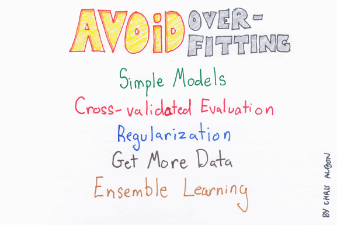
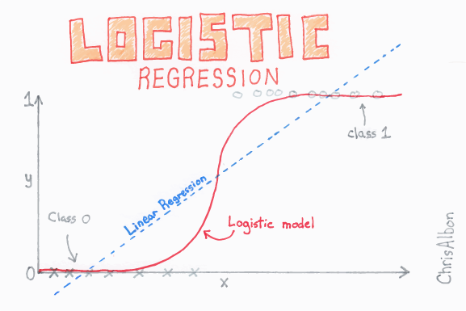
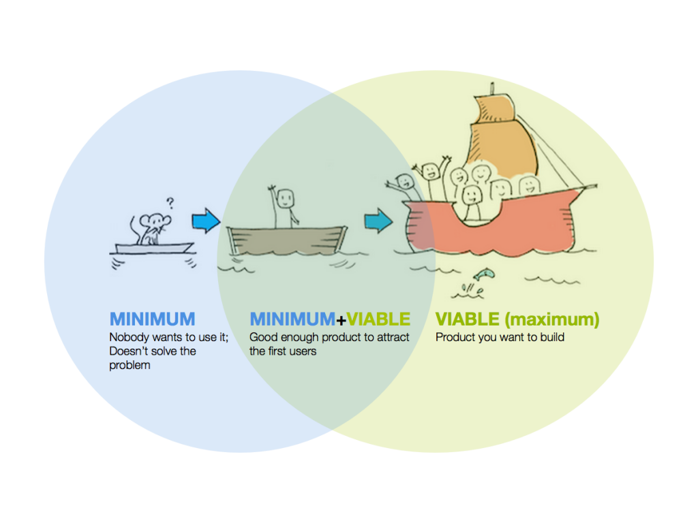

<style>
h1{font-weight: 400;}
</style>

```{r setup, include=FALSE}
knitr::opts_chunk$set(
  echo=TRUE, 
  message=FALSE, 
  warning=FALSE, 
  eval=FALSE, 
  fig.width=16/2, 
  fig.height=9/2
)
library(tidyverse)
library(broom)
library(knitr)
library(modelr)
library(lubridate)
library(forcats)
library(nycflights13)
library(patchwork)
library(okcupiddata)
# devtools::install_github("hadley/emo")
library(emo)

# Set seed value of random number generator to get "replicable" random numbers.
set.seed(76)
```

```{r, eval=FALSE, echo=FALSE}
# Run this separately to have slide output:
rmarkdown::render("index.Rmd", output_format = c("ioslides_presentation"), output_file = "slides.html")
```

<style>
h1{font-weight: 400;}
</style>


***


# Schedule 

<iframe src="https://docs.google.com/spreadsheets/d/e/2PACX-1vToPV6gfDlIq5ni1qezMcPy3ZdyIN1MtSSKZ3GABeBvf9LYu3_1XE7DOEQh4Dg02bKG5YF0XpSFO_-B/pubhtml?gid=402165754&amp;single=true&amp;widget=true&amp;headers=false" width="100%" height="740"></iframe>

<!--
{target="_blank"}
-->


***


# Lec 25: Mon 4/6

## Announcements

Midterm I has been graded and distributed.

1. You have the option to re-do Question 2 during Midterm II. As such, there are two grades on Moodle: one for Question 2 and one for the rest.
1. Distribution of scores:  
{ width=90% }
1. When studying for midterm II, I *highly* recommend you watch this screencast going over the solutions because some variation of some of the questions will likely occur for Midterm II.

<center>
<iframe src="https://www.showme.com/sma/embed/?s=cW0RpIm" width="578" height="433" frameborder="0"></iframe>
</center>


## Chalk Talk


1. ICYMI: The "An Introduction to Statistical Learning with Applications in R" is a good reference to have in case you want additional explanation. You can download a PDF [here](http://faculty.marshall.usc.edu/gareth-james/ISL/){target="_blank"}. For example, today's lecture on Random Forests is based on book page 316 (corresponding to PDF page 330).
1. Have the following ready before you watch the screencast:
    1. In your browser, easy access to the images below
    1. In another tab of your browser, ModernDive [Chapter 8 on Bootstrapping](https://moderndive.com/8-confidence-intervals.html){target="_blank"}. In particular, the beginning of Chapter 8 until the end of section 8.2 acts as a refresher on Bootstrapping.
    1. MassMutual -> `LASSO.R`. Load all the package then go to around line 59 where you fit a LASSO model with `glmnet(..., alpha = 1, ...)`. Then load the help file by running `?glmnet`
    

### 1. Closing out LASSO

A "Previously on SDS293" episode recap in images:

1. Image 1: LASSO for model selection AKA variable/feature selection:  
{ width=50% }
1. Image 2: More on feature selection:  
{ width=50% }
1. Image 3: LASSO is almost identical to another regularization method called "ridge regression."  
{ width=50% }
1. Image 4: The alpha you see below is akin to $\lambda$ in LASSO  
{ width=50% }


## 2. Random Forests

A "Next time on SDS293" episode sneak peak in images:

1. Image 1: General class of methods called "ensemble" methods:  
{ width=50% }
1. Image 2:  Random forests are one such "ensemble" method:  
{ width=50% }
1. Image 3:  Bootstrap resampling with replacement:  
{ width=50% }
1. Image 4: Bagging is another class of methods that uses bootstrapping: 
{ width=50% }
1. Image 5: But wait, there's more! Injecting a second source of variation
{ width=50% }

Here is a preview of the `random_forests.Rmd` file I'll be sharing with you for Wednesday's Lec26

```{r, eval=FALSE}
library(tidyverse)
library(randomForest)

# Load data and select only subset of variables:
train <- read_csv("https://rudeboybert.github.io/SDS293/static/train.csv") %>% 
  select(Id, CentralAir, Fireplaces, GrLivArea, YearBuilt, FullBath, SalePrice) %>% 
  # Convert to 1/0
  mutate(CentralAir = ifelse(CentralAir == "Y", 1, 0))
test <- read_csv("https://rudeboybert.github.io/SDS293/static/test.csv") %>% 
  select(Id, CentralAir, Fireplaces, GrLivArea, YearBuilt, FullBath) %>% 
  # Convert to 1/0
  mutate(CentralAir = ifelse(CentralAir == "Y", 1, 0))

# Transform outcome variable space:
train <- train %>% 
  mutate(logSalePrice = log(SalePrice + 1))

# Define model formula
model_formula <-
  "logSalePrice ~ CentralAir + Fireplaces + GrLivArea + YearBuilt + FullBath" %>%
  as.formula()

# Fit random forest:
model_rf <- randomForest(
  # Model formula
  form = model_formula,
  # Training data
  data = train, 
  # At each node of tree, number of features/predictor variables to randomly
  # choose from for splitting:
  mtry = 2,
  # Number of trees in your forest
  ntree = 100 
)

# Predict on test data
test <- test %>% 
  mutate(
    logSalePrice_hat = predict(object = model_rf, newdata = test),
    SalePrice_hat = exp(logSalePrice_hat) -1
  )
```


***


# Lec 24: Fri 4/3

## Announcements

1. PS6 Quiz is now live on Moodle until Saturday 4/4 11:59pm EDT.
1. Please setup access for the [Deep Learning Illustrated](https://www.deeplearningillustrated.com/){target="_blank"} eBook we'll be using later in the semester:
    1. Go to [RedShelf](http://redshelf.com/){target="_blank"} and create an account using your Smith email.
    1. Go to this [page](https://studentresponse.redshelf.com/book/1192517){target="_blank"} and add the book to your shelf. You'll have free access until May 25th.
    1. I will start assigning readings the week before.
1. No video lecture today.
1. PS6 is now posted in the class GitHub organization. If you want to work in groups, look at the PS7 `README.md` ASAP. This is an excellent opportunity to practice remote collaboration using a combination of Slack, GitHub, and Zoom. These are professional skills that I have found invaluable for my career.


***


# Lec 23: Wed 4/1

## Announcements

1. Problem sets: See [Lec22](#Lec22) for announcement about upcoming problem sets.
1. Zoom office hours and appointments:
    1. Posted on the [syllabus](syllabus.html). I will post more office hours once I read over all your survey responses.


## Chalk Talk

1. Recall from Lec01 "What is Machine Learning?" [slide 27](static/what_is_ML.pdf#page=27){target="_blank"}, the 3 models visualized in blue in the bottom three plots:
    1. The left model (straight line) is very low complexity, but it really doesn't fit the points well. The lack of fit can be measured with the *residual sum of squares (RSS)*: the vertical distances between the black points and the blue lines, all squared, and then summed. Note the formula for RSS is the "heart" of the formula for RMSE.
    1. The right model (very squiggly line) fits the data well and thus has a very small RSS, but this comes at the cost of a model with very high complexity. Accordingly, this model probably does not generalize well to other data points coming from the same population.
    1. The middle model (bimodal curve) is the right balance of complexity and fit.
1. The theory behind LASSO:
    1. Go to the MassMutual RStudio Project and open `CART.Rmd` and `LASSO.Rmd` and look at the optimization formulas for both cases. 
    1. Watch the following (20m29s) video    
    <iframe width="560" height="315" src="https://www.youtube.com/embed/65jwXCYMYIg" frameborder="0" allow="accelerometer; autoplay; encrypted-media; gyroscope; picture-in-picture" allowfullscreen></iframe>
1. If you have questions, ask in the `#questions` Slack channel indicating where your question is referring to. For example: "Video for Lec22.a) 10:52 Shouldn't that be y-hat = y-bar?"
1. Please give any feedback about your video viewing experience in `#general`. Please do not be shy with your criticisms; for remote lectures to work production values matter.


## Coding exercise

1. Using the same `LASSO.R` from Lec22, go over the remainder of the code: section 5, or roughly lines 183-295
1. If you have questions, ask in the `#questions` Slack channel indicating where your question is referring to. For example: "Lec22 `LASSO.R` around line 142 where it says `get_LASSO_coefficients()` what is that?" 


***


# Lec 22: Mon 3/30 {#Lec22}

## Announcements

1. If you haven't already, please read my update from Friday 3/27 in the "COVID-19" tab above.
1. Problem sets:
    1. We're going to resume our problem set schedule with PS6 as originally posted under [Lec18](#Lec18). A quiz on Moodle will be available from Friday 4/3 12:01am EDT to Saturday 4/4 11:59pm EDT
    1. PS7 on LASSO will be distributed as usual on Friday 4/3. More details, including groups, will come on Friday.
1. Zoom office hours and appointments: Posted on the [syllabus](syllabus.html). I will post more office hours once I read over all your survey responses.


## Chalk Talk

1. Open your MassMutual RStudio Projects and open:
    1. `regression.Rmd`
    1. `CART.Rmd`
    1. `LASSO.Rmd`
1. Watch the following two videos. Today has a little more video content that you can expect because we need to recap. 
    1. A recap of regression and CART (16m37s)  
    <iframe width="560" height="315" src="https://www.youtube.com/embed/0WC7MZ74hk0" frameborder="0" allow="accelerometer; autoplay; encrypted-media; gyroscope; picture-in-picture" allowfullscreen></iframe>
    1. Introduction to LASSO (13m05s)  
    <iframe width="560" height="315" src="https://www.youtube.com/embed/0g9aren7w48" frameborder="0" allow="accelerometer; autoplay; encrypted-media; gyroscope; picture-in-picture" allowfullscreen></iframe>
1. If you have questions, ask in the `#questions` Slack channel indicating where your question is referring to. For example: "Video for Lec22.a) 10:52 Shouldn't that be y-hat = y-bar?" (the answer is yes)
1. Please give **any** feedback about your video viewing experience in `#general`. Please do not be shy with your criticisms; for remote lectures to work production values matter. For example, I already know I need to work on
    1. Equalizing the sound better
    1. Stabilizing the focus of the camera


## Coding exercise

1. Go to `LASSO.R` on [GitHub](https://github.com/293-master/MassMutual/blob/master/LASSO.R)
1. Copy the contents of this file and save it in a file `LASSO.R` in your MassMutual RStudio Project
1. Go over the code up to and including section 4.d), or roughly lines 1-174
1. If you have questions, ask in the `#questions` Slack channel indicating where your question is referring to. For example: "Lec22 `LASSO.R` around line 142 where it says `get_LASSO_coefficients()` what is that?" 


***


# Lec 21: Fri 3/13

## Announcements

1. More COVID-19 preparations


***


# Lec 20: Wed 3/11

## Announcements

1. PS06 Quiz on Friday is cancelled until things settle down
1. Acknowledgement of situation
1. Issue of communication
1. Fill out [Remote Learning Preparedness Survey](https://docs.google.com/forms/d/e/1FAIpQLSephAwln2B1SA1jQPpHCzGr2vT5G0ctfASq5FTIwngXHBxBDw/viewform){target="_blank"}
1. Testing Zoom video conferencing
    1. Testing lecture format
    1. Practice run of creating meetings


***


# Lec 19: Mon 3/9

## Announcements

1. Midterm I is still going on. Honor Code still applies.


## Recap

1. StitchFix exercise
    1. Slack `#general` message
    1. Closing comments


## Chalk Talk

1. Finishing ROC curves:
    1. Open MassMutual.Rproj -> `ROC.Rmd` -> `## Background` -> first code chuck where `values` csv is loaded. Replace its contents with what I just shared on Slack.
    1. 4 alternative scenarios of ROC curves
1. Starting LASSO: L1 regularization for adjusting model complexity of linear models
    1. Open MassMutual.Rproj -> `LASSO.Rmd`


***


# Lec 18: Fri 3/6 {#Lec18}

## Announcements 

1. FYI: you will not be penalized for missing class due to illness.
1. Shorter PS6: Listen to New Economics Founding 58m [podcast interview](https://neweconomics.org/2019/11/weekly-economics-podcast-algorithms-of-oppression-live){target="_blank"} of [Safiya Umoja Noble](https://safiyaunoble.com/){target="_blank"}, author of [Algorithms of Oppression](https://en.wikipedia.org/wiki/Algorithms_of_Oppression){target="_blank"}. Then on Friday 3/13:
    1. In-class quiz. Not meant to be difficult, rather just to ensure you actually listen to podcast.
    1. In-class discussion.

{ width=30% }


## Recap

1. Based on a decision threshold $p^*$, contingency table for 2x2 possible truth vs prediction scenarios. 
1. An ROC curve is a parametric curve based on $p^*$ onto $(x(p^*), y(p^*))$.
1. The AUC is the area under the ROC curve. Always between 0 & 1.


## Chalk Talk

1. Go over solutions to PS5
1. Different ROC curves and AUC's for different prediction scenarios.
1. In-class activity


***


# Lec 17: Wed 3/4

## Announcements

<center>
{ width=100% }
</center>

## Recap

1. `NA`


## Chalk Talk

1. What curve does logistic regression fit?
1. Binary classification problems ROC curves:
    + Decision rule for $\widehat{y}$ based on $\widehat{p}$
    + 2x2 contingency tables for a given threshold $p^*$. Then based on a contingency table for a given threshold $p^*$, some examples of table summaries include [Sensitivity and Specificity](https://en.wikipedia.org/wiki/Sensitivity_and_specificity){target="_blank"}
    + Math theory: [Parametric curve/equation](https://en.wikipedia.org/wiki/Parametric_equation){target="_blank"}
    + MassMutual RStudio Project -> `ROC.Rmd` Shiny App.


***


# Lec 16: Mon 3/2

## Announcements

1. Discuss Midterm I
1. PS5

## Chalk Talk

1. Go over MassMutual -> `logistic_regression.Rmd`
1. Time permitting start ROC curves: `ROC.Rmd` Shiny app


***


# Lec 15: Fri 2/28

## Announcements

1. Midterm I is a Seelye self-scheduled exam from next Fri 3/6 5pm thru Mon 3/9 11pm. We'll discuss on Monday Lec 16.
1. PS5 on logistic regression assigned.
1. PS6 assigned on Fri 3/6 will relate to ethics in machine learning and will not involve any coding.

## Chalk Talk

1. In-class demo of possible approach to PS4: implementing algorithm to obtain the "optimal" complexity parameter `cp` value using cross-validation (we will be verifying that your PS4 submissions on GitHub are all before 9am today).
1. Go over MassMutual -> `logistic_regression.Rmd`
1. Time permitting start ROC curves: `ROC.Rmd` Shiny app


***


# Lec 14: Wed 2/26

## Announcements

1. `NA`


## Chalk Talk

1. Step back: Recall cross-valiation is a generalization of the "validation set" idea to ensure we are not over-fitting models  
{ width=50% }
1. Intro to logistic regression  
{ width=50% }{ width=50% }
1. Transforming probability space to log-odds/logit space. The following two plots are the same but with the axes flipped. In other words:
    + The left plot visualizes how we map from probability space $[0,1]$ to log-odds space $(-\infty, \infty)$
    + The right plot visualizes how we map from log-odds space $(-\infty, \infty)$ back to probability space $[0,1]$  
```{r, echo=FALSE, eval=TRUE}
eps <- 0.0001
values <- tibble(
  p = seq(from = eps, to = 1-eps, length = 1000),
  y = log(p/(1-p))
)
points <- tibble(
  p = c(0.01, 1-0.01, 0.5),
  y = log(p/(1-p)),
  group = factor(1:3)
)

plot1 <- ggplot(values, aes(p, y)) +
  geom_line() +
  geom_hline(yintercept = 0,  alpha=0.5) +
  geom_vline(xintercept = 0.5, alpha=0.5) +
  # geom_vline(xintercept = 0, linetype="dashed", alpha=0.5) +
  # geom_vline(xintercept = 1, linetype="dashed", alpha=0.5) +
  geom_point(data=points, aes(col=group), size=5) + 
  theme(legend.position="none") +
  labs(x="Probability p", y="log-odds", title="log-odds over probability")
plot2 <- plot1 +
  coord_flip() + 
  labs(x="Probability p", y="log-odds", title="probability over log-odds")
plot1 + plot2
```
1. At 10:10, 30 minutes of paired programming for PS5 but now with other person typing.


<!--
Here are the two equations:

$$
\begin{align}
\mbox{left function} = \mbox{log-odds} = \mbox{logit}(p) &= \log\left(\frac{p}{1-p}\right) = \alpha\\
\mbox{right function} = \mbox{inverse-logit}(\alpha) &= \frac{\exp(\alpha)}{\exp(\alpha) + 1} = \frac{1}{1+ \exp(-\alpha)} = p
\end{align}
$$
-->


***


# Lec 13: Mon 2/24

## Announcements

1. [SDS talk this week](https://smithcollege-sds.github.io/sds-www/speaker_Hu.html#public_lecture:_generating_synthetic_family_income_for_the_consumer_expenditure_surveys){target="_blank"} on balancing between "having useful data" and "maintinaing sufficient privacy protection":
    + What: "Generating Synthetic Family Income for the Consumer Expenditure Surveys"
    + Who: Prof. Jingchen (Monika) Hu, Vassar College
    + When: Thursday Feb 27, 5pm
    + Where: McConnell Hall 103
{ width=100% }


## Chalk Talk

1. Lec01 "What is Machine Learning?" [slide 28](static/what_is_ML.pdf#page=28){target="_blank"}
1. $k$ fold cross-validation  
{ width=50% }
1. Pseudocode for:
    a) Using crossvalidation to estimate error
    b) Using crossvalidation error estimates to find "optimal" level of complexity
    c) Using "optimal" level of complexity to make predictions


## In-class Exercise

1. Pair-programming for PS4


***


# Lec 12: Fri 2/21

## Announcements

1. `NA`


## Topics

1. In-class exercise
1. Lec01 "What is Machine Learning?" [slide 28](static/what_is_ML.pdf#page=28){target="_blank"} 
1. MassMutual RStudio Project -> `coding.Rmd` -> `# Wednesday, July 24 2019` -> `## Cross-validation`  


***


# Lec 11: Wed 2/19

## Announcements

{ width=75% }  


## Chalk Talk

Recap of Lec10:

1. Idea of "validation sets":  
{ width=75% }  
<!--
fit/train model to one set of data, but evaluate it's predictive performance on another set of data. In other words, *validate* the fitted model on another set of data.
-->
1. We want to know the proportion of the sampling bowl's balls that are red. We don't have the energy to do a census, so we take a sample. Why is important to mix the bowl first?  
{ width=50% }
1. Lec01 "What is Machine Learning?" [slide 26](static/what_is_ML.pdf#page=26){target="_blank"} stresses importance of "validation sets" when training a self-driving car.
    
Today:
    
1. Create a table comparing 3 types of RMSLE scores for two `cp` values: `cp=0` (relatively more complex tree)  & `cp=0.2` (relatively less complex tree)
1. Comparing performance of underfit vs overfit models as a function of model complexity. See Lec01 "What is Machine Learning?" [slide 27](static/what_is_ML.pdf#page=27){target="_blank"}.
1. How do we figure out what is "optimal" model complexity?
    + In other words, the best setting of the "complexity" dial aka knob?
    + For example in MassMutual RStudio Project -> `CART.Rmd` -> best slider value of $\alpha$ = `cp` complexity parameter?


***


# Lec 10: Mon 2/17

## Announcements

* Sit next to your PS3 partner
* Problem sets:
    + PS3 posted
    + I'm still coordinating with grader. You'll get PS1 scores shortly.
    + Great common student question: "Why are randomizing groups? Why can't we just pick our own?"


## Chalk Talk

1. $\log$-transformations (you'll be doing this in PS3)
    + Problem: many students who used `OverallQual` as a predictor, ended up with a negative prediction $\widehat{y}$ = $\hat{\text{SalePrice}}$
    + Solution: Transforming the outcome variable space, then fitting your model, then predicting, then returning to the original variable space
1. Recap of underfitting vs overfitting:  
{ width=50% }{ width=50% } 
1. Why is overfitting a problem?
    + Solutions to Lec09 Exercise are posted on Slack: showing the consequences on RMSLE of making predictions on separate `test` data using a model that is HELLA overfit to the `training` data using `cp = 0`.
    + What are validation sets? Train your model on one set of data, but evaluate your predictions on a separate set of data. Recall Lec01 "What is Machine Learning?" [slide 26](static/what_is_ML.pdf#page=27){target="_blank"} on training a self-driving car versus evaluating it's performance.


***


# Lec 09: Fri 2/14

## Announcements

1. I'm almost finished PS3. A large part of it will involve fitting a CART model to the same house prices data as in PS2.
1. Check out [Machine Learning Flashcards](https://gumroad.com/l/machinelearningflashcards){target="_blank"} posted on Slack in `#general`
1. Open Slack and please join the `#questions` channel. Ask all non-private questions here.

## Chalk Talk

1. PS2 recap
    + Two TODO's for this PS: 1) compute RMSLE and 2) submit Kaggle predictions. Where do I use `train` and where do I use `test`?
    + RMSE vs RMSLE. What's the difference? Recall from Lec04 our [discussion on orders of magnitude](https://moderndive.com/A-appendixA.html#appendix-log10-transformations){target="_blank"}.
1. CART wrap-up
    a) Open MassMutual RStudio Project -> `CART.Rmd` -> Explain $\widehat{p}_{mk}$, in particular how it plays into "Gini Index".  
    { width=50% }
    a) What does the equation become when $y$ is numerical
    a) Tie-in CART "complexity parameter" $\alpha$ with Lec01 "What is Machine Learning?" [slide 20](static/what_is_ML.pdf#page=20){target="_blank"} on under vs overfit models.
1. Two possible model outcomes: Underfitting vs overfitting:  
{ width=50% }{ width=50% }  
1. Open MassMutual RStudio Project -> `coding.Rmd` -> `# Wednesday, July 24 2019` -> `Demonstration of overfitting`
    a) `model_CART_3` corresponds to a HELLA overfit model. i.e. it doesn't generalize.
    b) Exercise: Fit the same model but to only half the data, predict on the other half.  
    { width=75% }  


***


# Lec 08: Wed 2/12

## Announcements

1. `NA`


## Chalk Talk

### Special cases

1. How do I do binary splits on categorical predictors that have been *one-hot encoded*. Note: many statistical software packages will do this automatically for you.  
{ width=50% }
1. Works for both types of outcomes $y$: numerical & categorical. Show code


### What does the complexity parameter do?

Today's chalk talk on CART is based on the Tuesday PM topics in the [MassMutual Google Doc](https://docs.google.com/document/d/1kBl8ivTeNyVfbV0gvXjBpwnlRWXvZkKuSe0SMTjFB38/edit#heading=h.4llig2jamgry){target="_blank"}. 

Open the MassMutual RStudio Project -> `CART.Rmd` Shiny app. (Note: after you install the necessary packages, this should knit.) 

1. On what variable and where along selected variable do the splits occur?
1. How many splits, i.e. how far do we "grow" the tree? Or in other words, how *complex* do we make the tree?


***


# Lec 07: Mon 2/10

## Announcements

* Open 293 GitHub organization -> look at PS2


## Chalk Talk

Today's chalk talk on CART is based on the Tuesday PM topics in the [MassMutual Google Doc](https://docs.google.com/document/d/1kBl8ivTeNyVfbV0gvXjBpwnlRWXvZkKuSe0SMTjFB38/edit#heading=h.4llig2jamgry){target="_blank"}. 
{ width=50% }


Open the MassMutual RStudio Project:
  
**First:** Based on `coding.Rmd` -> Tuesday -> `iris` dataset. (Note: You might have to do a little debugging to get this to knit, like setting `eval = TRUE` for all code blocks.)

1. What is classification?
1. How do I interpret trees? Binary splits on predictor variables
1. Go over code for CART.


***


# Lec 06: Fri 2/7

## Announcements

* PS1
    + Sit next to your PS1 teammate for today's in-class exercise
    + Albert will go over some PS1 highlights
* PS2: Groups posted, but do not clone PS2 repos until I say so. It will involve:
    1. Creating a model with 3 numerical & 3 categorical variables
    1. Applying your fitted model to the training data, comparing $y$ and $\hat{y}$, and computing RMLSE using `mutate()`
* Open [syllabus](syllabus.html): office hours calendar posted on top. 
* If you haven't already, please change your default GitHub profile picture. It doesn't have to be a picture of you, but please put an image. This will help me quickly identify who's who. 


## Chalk Talk

### 1. Lec05 Recap

Exercise from Lec05 -> MassMutual RStudio Project -> Tuesday -> Exercise: Submit Kaggle predictions using linear regression model.

1. What issues did you encounter?
1. What variables did you use? Did you not use? 
    
    
### 2. Git merge conflicts

In-class exercise. The screencast is posted [here](https://www.loom.com/share/83499c93430c4ff6a9f3d08478606a88){target="_blank"}.

1. Open:
    + RStudio -> PS1 RStudio Project
    + GitHub organization for this class (click octocat button on top)
1. Both of you, "pull" your repo to update it
1. Both of you, edit *the same line* in `README.md`, but write something different.
1. Both of you, commit your change but do not push it yet.
1. Only one of you (call them person A), push your commit.
1. Person B: Try to push your commit. You won't be able to because you have a *merge conflict*. You need to resolve it.
1. Person B: "Pull" your repo to bring in the merge conflict.
1. Both of you, resolve the merge conflict together.


### 3. Ethical discussion

The `iris` dataset has historically been one of the most widely used datasets in statistics, first collected by Ronald A. Fisher. Type `?iris` in the console and look at "Source." While Fisher has done a lot to advance the field, some of his views were IMO [problematic](https://njoselson.github.io/Fisher-Pearson/){target="_blank"}.


### 4. Classification & Regression Trees

What are classification and regression trees? Here is one example from the [New York Times](https://www.nytimes.com/interactive/2019/08/08/opinion/sunday/party-polarization-quiz.html){target="_blank"}. Note: Smith students can get free access to the New York Times and Wall Street Journal via [Smith Libraries](https://libraries.smith.edu/news/2019/09/new-online-access-new-york-times-and-wall-street-journal){target="_blank"}.


***


# Lec 05: Wed 2/5

## Announcements

* Added two notes to [PS1](PS.html#PS1)


## Chalk Talk

* Multiple regression
* In MassMutual RStudio Project -> Tuesday -> Kaggle -> Exercise on Kaggle submission.


***


# Lec 04: Mon 2/3

## Announcements

* For this week's lectures, sit with your PS1 teammate. The groups are posted on Slack under `#general`
* Lecture policies
    + You don't need to inform me about occasional absenses, but please give your teammate a heads up as a curtesy.
    + Please do not leave in the middle lecture, unless you get prior approval from me, as this can be very distracting. After you get prior approval, please sit near the exit.
* [PS1 is now ready!](PS.html#PS1)


## What is a minimally viable product?

When building a product, in my opinion (IMO):

* **Don't**: Try to do everything completely and perfectly from the beginning. This leads perfectionism, which leads to procrastination and "analysis paralysis."
* **Do**: Start by finishing a [minimially viable product](https://www.interaction-design.org/literature/article/minimum-viable-product-mvp-and-design-balancing-risk-to-gain-reward){target="_blank"} ASAP!

<center>
{ width=525px }
</center>

Once you're done your MVP, iterate and improve by slowly adding complexity that work:

<center>
{ width=525px }
</center>

In other words:

* [Done is better than perfect](https://lifehacker.com/done-is-better-than-perfect-5870379){target="_blank"}
* [Don't let the perfect be the enemy of the good](https://www.huffpost.com/entry/dont-let-the-perfect-be-t_b_158673){target="_blank"}
* [Think big, start small](https://www.forbes.com/sites/chunkamui/2016/01/03/6-words/#15457a371a3b){target="_blank"}


## Chalk Talk

* In-class demo
* Open `MassMutual` RStudio Project -> `coding.Rmd` -> `# Tuesday, July 23 2019` -> `## Gentle Introduction to Kaggle Competitions`. Discussion on:
    + "Minimally viable product" model $\widehat{y} = \overline{y}$ for *all* houses.
    + log10-transformations:
        * A [discussion on orders of magnitude](https://moderndive.com/A-appendixA.html#appendix-log10-transformations){target="_blank"} as well as another [house prices example](https://moderndive.netlify.com/11-thinking-with-data.html#house-prices-EDA-I){target="_blank"} of a log10-transformation.
        * [Powers of Ten](https://youtu.be/0fKBhvDjuy0?t=40){target="_blank"} movie by Charles and Ray Eames.


***


# Lec 03: Fri 1/31

## Announcements

* GitHub organization for this class:
    + Access it by clicking the "octocat" icon on the top left of this page
    + Ensure you are a member (I sent an email invite yesterday)
* GitHub profile. Think of it as an extension of your resume. I highly encourage, but do not require, you to:
    + Post your full name
    + Post your affiliation
    + Post a public-facing profile picture (it doesn't have to be an image of you, it can be any picture).
    + Please don't change your GitHub ID's mid-semester!
* FYI: GitHub is not without [controversy](https://techcrunch.com/2019/11/13/github-faces-more-resignations-in-light-of-ice-contract/){target="_blank"}

## Chalk Talk

GitHub has many definitions that are unforunately not straight forward. Using [`fivethirtyeight`](https://github.com/rudeboybert/fivethirtyeight){target="_blank"} R package as an example.

* Git vs GitHub
* Local vs remote
* Repos & `README.md` files as cover pages
* Cloning a repo locally (which in our case correspond to RStudio Projects). Ex: Big green "Clone or download" button on top right.
* Commit/push and pull. Commits as units of change. Ex: Click "commits" tab on top left (currently at 523 commits)
* Branches: `master` branch is what you see. Ex: Click "Branch" button on top left 
* Making contributions to `master`
    + When on the inside: Create a new branch, make edits in branch, then make pull request
    + When on the outside: Fork the repo (similar to creating a branch), make edits in your forked copye of repo, then make pull request
    + Ex: Click on Insights tab on top right -> Network -> Scroll to earlier dates. 
* Learning git has a steep learning curve. This is normal:
    + [xkcd](https://xkcd.com/1597/){target="_blank"}
    + [Oh shit, git!](https://gumroad.com/l/oh-shit-git){target="_blank"}
    + In this class: I'll (gently) force you to practice merge conflicts


***


# Lec 02: Wed 1/29

## Announcements

* On Sun 1/26 I sent an email including links to join Slack and a Intro Survey Google Form. If you did not receive this email, please come see me after class.
* Syllabus [posted](syllabus.html)


## Chalk Talk

* In [MassMutual Google Doc](https://docs.google.com/document/d/1kBl8ivTeNyVfbV0gvXjBpwnlRWXvZkKuSe0SMTjFB38/edit#heading=h.4llig2jamgry){target="_blank"}: Tuesday AM.


***


# Lec 01: Mon 1/27

## Announcements


## Chalk Talk

* Went over "What is Machine Learning?" [slides](static/what_is_ML.pdf){target="_blank"}.
